.. _example-programs:

********************
  Example Programs
********************

.. currentmodule:: urwid

These example programs may be found in the examples directory of your
Urwid distribution.

tour.py
-------

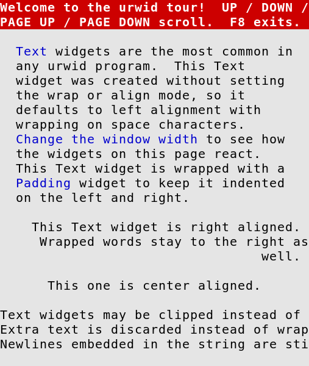
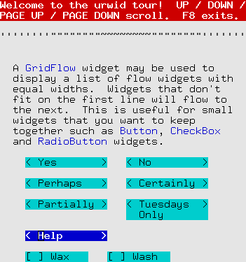

Show how many of the standard widgets may be arranged
on the screen

graph.py
--------

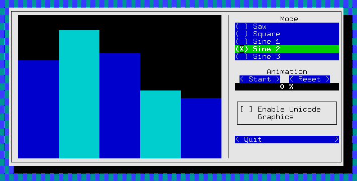

Demonstrate BarGraph widget and alarms used for animation

edit.py
-------

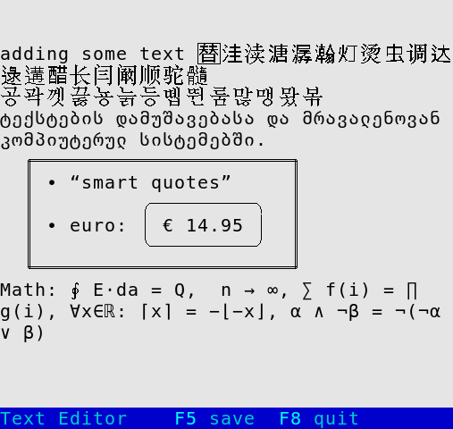

A simple text editor with lazy loading

browse.py
---------

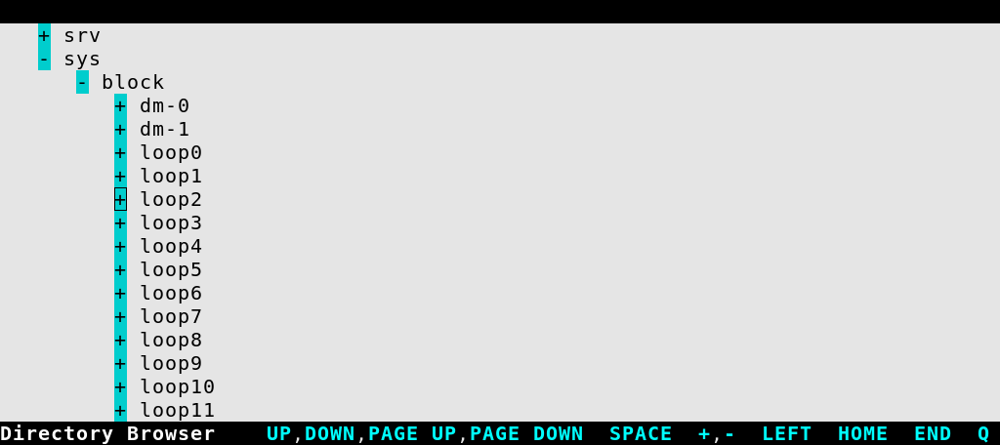

A lazy directory browser with file selection, tree-view, custom widgets
and list walker

subproc.py
----------

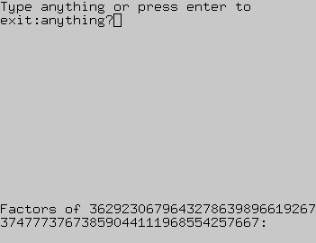

Monitor and display results from a subprocess

palette_test.py
---------------

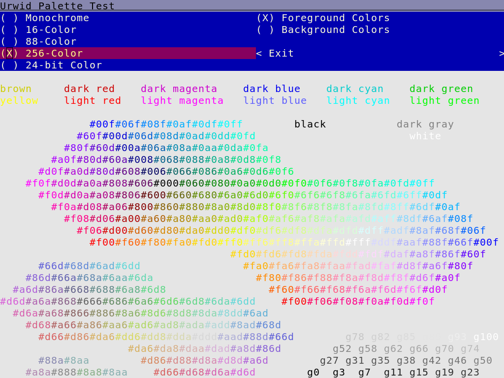

Show available colors in various screen modes

pop_up.py
---------

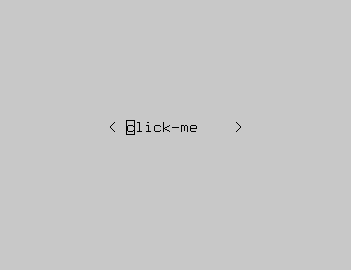
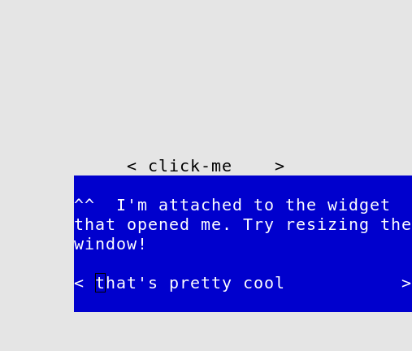

Create a pop-up/drop-down/window anchored to another widget

bigtext.py
----------

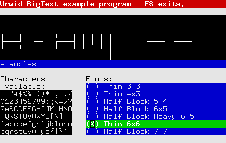
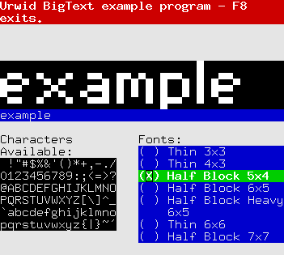

demonstrate the BigText widget
