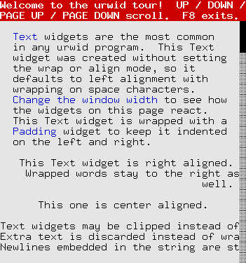
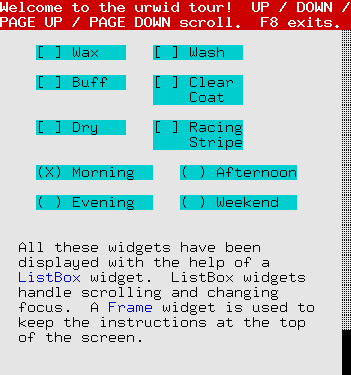
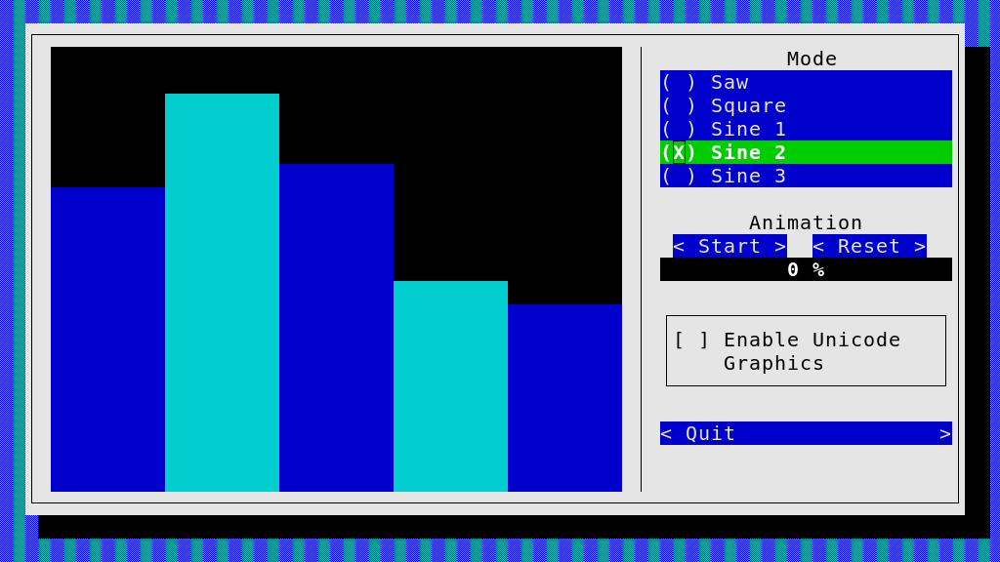
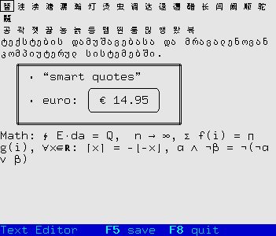
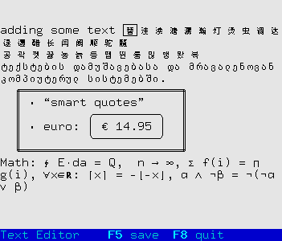
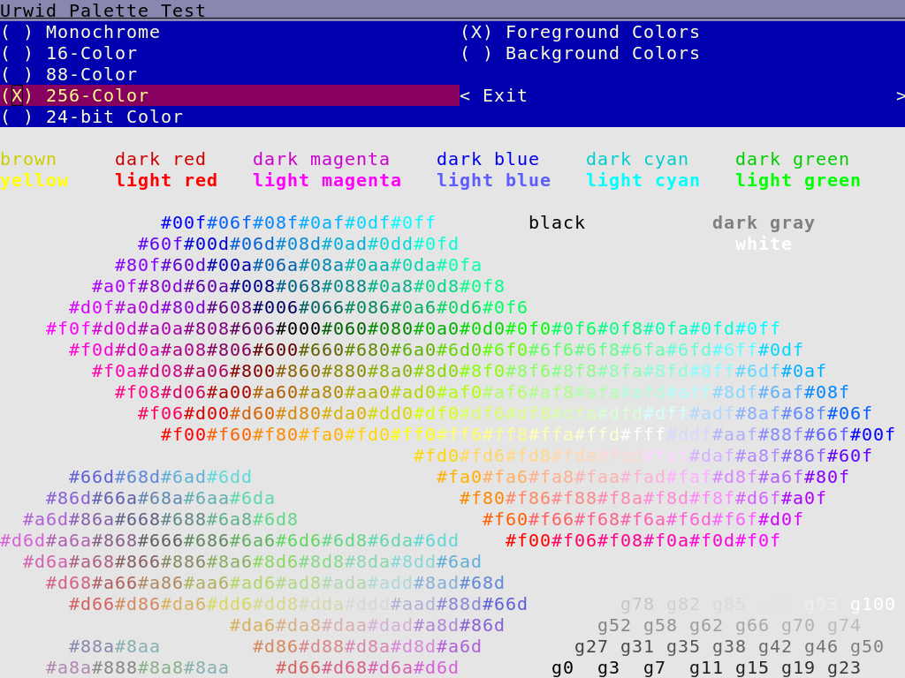
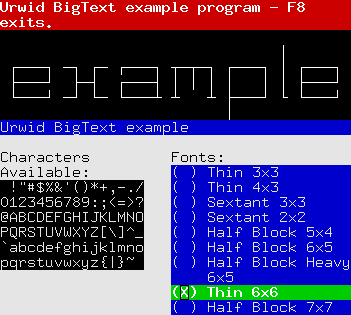
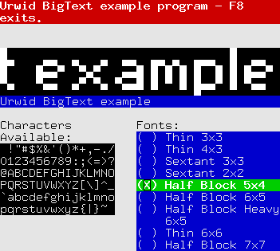

.. _urwid-tutorial:

********************
  Example Programs
********************

.. currentmodule:: urwid

These example programs may be found in the examples directory of your
Urwid distribution.

tour.py
-------

A simple example showing how many of the standard widgets may be arranged
on the screen

graph.py
--------

A demonstration of the BarGraph widget and alarms used for animation

edit.py
-------

A simple text editor with lazy loading

browse.py
---------

A lazy directory browser with file selection, tree-view, custom widgets
and list walker

palette_test.py
---------------

Shows available colors in various screen modes

bigtext.py
----------

A demonstration of the BigText widget
