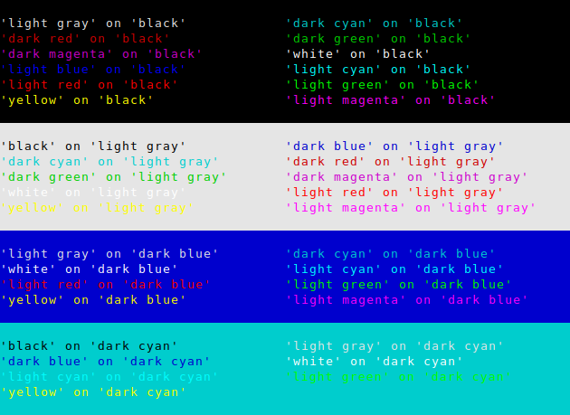
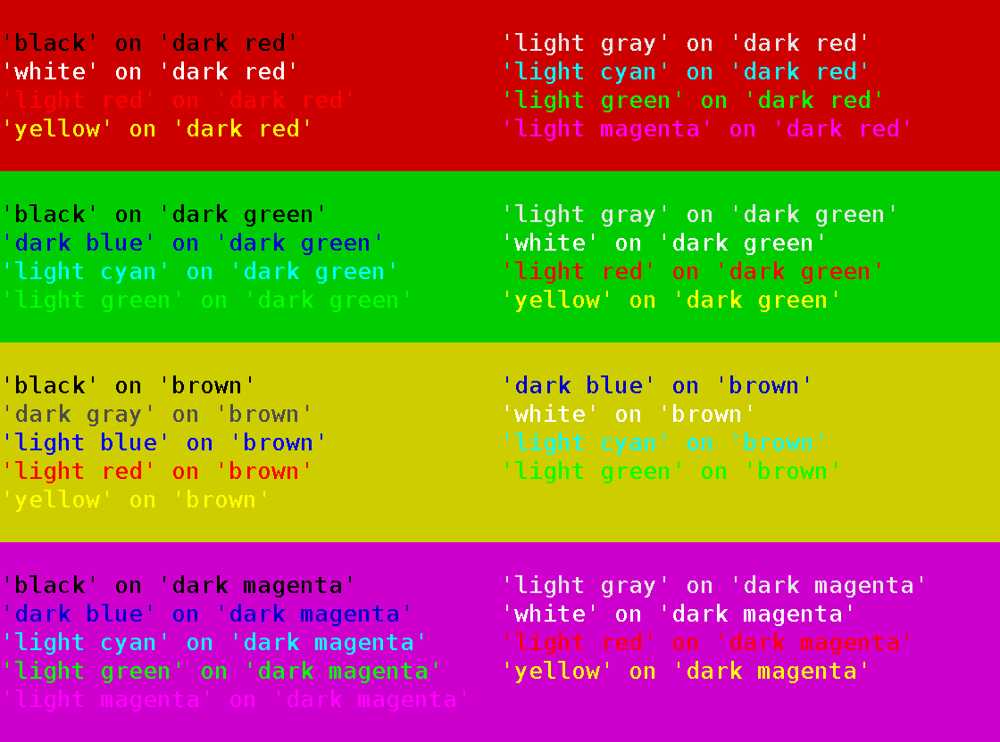

.. _display-attributes:

**********************
  Display Attributes
**********************

.. currentmodule:: urwid

Urwid supports a number of common display attributes in monochrome, 16-color,
88-color, 256-color, and 24-bit (true color) modes.

You are encouraged to provide support for as many of these modes as you like, while
allowing your interface to degrade gracefully by  providing command line arguments
or other interfaces to switch modes.

When setting up a palette with :class:`MainLoop` (or directly
on your screen instance), you may specify attributes for 16-color, monochrome
and high color modes. You can then switch between these modes with
:meth:`screen.set_terminal_properties() <raw_display.Screen.set_terminal_properties>`,
where ``screen`` is your screen instance or :attr:`MainLoop.screen`.

.. seealso::
   :meth:`register_palette() reference <BaseScreen.register_palette>`,

.. _using-display-attributes:

Using Display Attributes
========================

Once you have defined a palette you may use its display attribute names
anywhere that expects a display attribute.  When no display attribute is defined
``None`` is used as a default display attribute.

``None`` will typically be rendered with the terminal's default foreground and
background colors.

You can also specify an exact foreground and background using an
:class:`AttrSpec` instance instead of a display attribute name.
Using :class:`AttrSpec` instances in your code may be trickier than using your
screen's palette because you must know which mode (number of colors) the screen is in.

.. _text-markup:

Text Markup
-----------

A :class:`Text` widget can specify which display attributes each part of the
text will use with the format defined in :class:`Text class reference <Text>`.
Some examples:

::

    Text(u"a simple string with default attribute")

The string and space around will use the ``None`` default display attribute
which usually appears in the terminal's default foreground and background.

::

    Text(('attr1', u"a string in display attribute attr1"))

The string will appear with foreground and backgrounds specified in the display
module's palette for ``'attr1'``, but the space around (before/after) the text
will appear with the default display attribute.

::

    Text([u"a simple string ", ('attr1', u"ending with attr1")])

The first three words have the default display attribute and the last three words have
display attribute ``'attr1'``.

::

    Text([('attr1', u"start in attr1 "), ('attr2', u"end in attr2")])

The first three words have display attribute ``'attr1'`` and the last three words have
display attribute ``'attr2'``.

::

    Text(('attr1', [u"nesting example ", ('attr2', u"inside"), u" outside"]))

When markup is nested the inner attribute is placed over the outer one. Here ``"inside"``
has attribute ``'attr2'`` and all the rest of the text has attribute
``'attr1'``. A color that ``'attr2'`` leaves to ``'inherit'`` is taken from ``'attr1'``
(see :ref:`inherit-foreground-background`). :meth:`Text.get_text` returns such a run as
``LayeredAttr('attr2', 'attr1')``.

Assigning Display Attributes with AttrMap
-----------------------------------------

If you want a whole widget to be assigned a display attribute, or if you want to change
one or more display attributes to other display attributes, you can wrap your widget
in an :class:`AttrMap` widget.  :class:`Text` widgets have no way to specify
a display attribute for the whitespace around the text caused by alignment and wrapping
so :class:`AttrMap` may be used. Some examples:

::

    AttrMap(Text(u"hello"), 'attr1')

The whole :class:`Text` widget will have display attribute ``'attr1'`` including
whitespace around the ``"hello"`` text.

::

    AttrMap(Text(('attr1', u"hello")), 'attr2')

The ``u"hello"`` text will appear with display attribute ``'attr1'`` and all surrounding
whitespace will appear with display attribute ``'attr2'``.

::

    AttrMap(Text([('attr1', u"hello"), u" world"]), {'attr1': 'attr2'})

The :class:`AttrMap` widget will apply display attribute ``'attr2'`` to all parts of
the :class:`Text` widget that are using ``'attr1'``.  The result is the ``"hello"``
text appearing with display attribute ``'attr2'`` and all other text and whitespace
appearing in the default display attribute.

The attributes of the wrapped widget are placed over the attribute :class:`AttrMap` gives to
``None``, so a color they leave to ``'inherit'`` is taken from it:

::

    AttrMap(Pile([Text(('red_fg', u"error")), Text(u"plain")]), 'panel_bg')

With ``('red_fg', 'dark red', 'inherit')`` and ``('panel_bg', 'inherit', 'dark blue')`` in the
palette, ``"error"`` is dark red and all other text and whitespace is in the default foreground,
everything on dark blue.

:class:`AttrMap` can also change display attributes differently when they are in focus.
This can be used to "highlight" one or more widgets to make your interface more
user friendly.  To use this feature set the ``focus_map`` parameter when creating the
:class:`AttrMap` widget.

.. _foreground-background:

Foreground and Background Settings
==================================

.. list-table::
   :header-rows: 1
   :widths: 23 15 10 10 15

   * - Supported by Terminal
     - xterm / gnome-term
     - rxvt
     - linux console
     - others
   * - :ref:`16 standard foreground colors <16-standard-foreground>`
     - YES
     - YES
     - YES
     - very widely supported
   * - :ref:`8 standard background colors <8-standard-background>`
     - YES
     - YES
     - YES
     - very widely supported
   * - :ref:`default foreground/background <default-foreground-background>`
     - YES
     - YES
     - YES
     - widely supported
   * - :ref:`bold, underline, standout <bold-underline-standout>`
     - YES
     - YES
     - standout
     - widely supported
   * - :ref:`italics <bold-underline-standout>`
     - YES
     - YES
     - NO
     - widely supported
   * - :ref:`blink <bold-underline-standout>`
     - YES/NO
     - NO
     - NO
     - some support
   * - :ref:`strikethrough <bold-underline-standout>`
     - YES
     - NO
     - NO
     - some supported
   * - :ref:`faint <bold-underline-standout>`
     - YES
     - NO
     - NO
     - some support
   * - :ref:`"bright" background colors <bright-background>`
     - YES
     - urxvt
     -
     - some support
   * - :ref:`256-color foreground/background <256-foreground-background>`
     - YES
     -
     -
     - some support
   * - :ref:`88-color foreground/background <88-foreground-background>`
     - w/palette setting
     - urxvt
     -
     - limited support
   * - :ref:`RGB palette setting <rgb-palette-setting>`
     - YES
     -
     -
     - limited support

.. _16-standard-foreground:

16 Standard Foreground Colors
-----------------------------

* ``'black'``
* ``'dark red'``
* ``'dark green'``
* ``'brown'``
* ``'dark blue'``
* ``'dark magenta'``
* ``'dark cyan'``
* ``'light gray'``
* ``'dark gray'``
* ``'light red'``
* ``'light green'``
* ``'yellow'``
* ``'light blue'``
* ``'light magenta'``
* ``'light cyan'``
* ``'white'``

.. _8-standard-background:

8 Standard Background Colors
----------------------------

* ``'black'``
* ``'dark red'``
* ``'dark green'``
* ``'brown'``
* ``'dark blue'``
* ``'dark magenta'``
* ``'dark cyan'``
* ``'light gray'``

.. _default-foreground-background:

Default Foreground and Background
---------------------------------

* ``'default'`` (or simply ``''``)

``'default'`` may be specified as a foreground or background to use a
terminal's default color. For terminals with transparent backgrounds
``'default'`` is the only way to show the transparent background. There is no
way to tell what the default colors are, so it is best to use default
foregrounds and backgrounds together (not with other colors) to ensure good
contrast.

.. _inherit-foreground-background:

Inherited Foreground and Background
-----------------------------------

* ``'inherit'``

``'inherit'`` may be specified as a foreground or background color (with settings:
``'inherit,bold'``) to take that color from the enclosing display attribute: the
attribute of the outer markup, or the attribute an :class:`AttrMap` around the widget gives to
``None``. With nothing enclosing it, the color comes from the ``None`` palette entry, so
registering ``(None, 'default', 'dark magenta')`` gives every attribute with an ``'inherit'``
background a dark magenta background. A color is resolved separately for each run of text, so
the text after a run with its own background shows the enclosing background again.

This lets a few foreground-only and background-only palette entries replace an entry for every
combination of them. To highlight the focused row of a list whose text uses many foreground
colors, give those entries an ``'inherit'`` background and wrap each row:

::

    palette = [
        ('method', 'light green', 'inherit'),
        ('size', 'brown', 'inherit'),
        ('focus_bg', 'inherit', 'dark blue'),
    ]
    row = AttrMap(Columns([Text(('method', u"GET")), Text(('size', u"1k"))]), None, focus_map='focus_bg')

When an attribute inherits a color, a setting (``'bold'``, ``'underline'``, ...) it does not
mention is taken from the enclosing attribute, and ``'no-'`` turns one off: with
``('plain', 'inherit,no-bold', 'inherit')`` inside a bold attribute, the text is not bold. An
attribute that sets both colors, including ``'default'`` and ``''``, hides the enclosing
attribute completely, settings included. Attributes are combined from the outermost inward, so
each one keeps what all of the attributes around it set. :class:`ANSIText` turns an SGR reset
such as ``ESC[24m`` into ``'no-underline'``, so the reset also applies to the enclosing attribute.

A change to a palette entry shows on the next :meth:`MainLoop.draw_screen`, and neither the
widgets nor the screen have to be redrawn for it: the raw and web displays compare each drawn
row by its resolved colors and write again only the rows whose colors changed, and curses
writes every row on each draw.

:meth:`AttrSpec.layered_over` combines two specifications. Canvases record the enclosing
attributes as a :class:`LayeredAttr`; a custom display module turns any canvas attribute into an
:class:`AttrSpec` with :meth:`BaseScreen.resolve_attr` instead of reading the palette itself.
An :class:`AttrMap` can replace a :class:`LayeredAttr` as a whole by using it as a key.

Code written for earlier releases sees these differences, also with palettes that never use
``'inherit'``:

* Nested markup and attributes inside an :class:`AttrMap` appear as :class:`LayeredAttr` in
  :meth:`Text.get_text` and in canvas content, where they used to be the innermost name.
* A display module that reads ``self._palette`` itself shows layered attributes in default
  colors; it calls :meth:`BaseScreen.resolve_attr` instead.
* An attribute an :class:`AttrMap` maps to ``None`` shows the map's ``None`` attribute.
* :meth:`AttrSpec.copy_modified` without ``colors`` keeps the 88-color or true-color mode of the
  specification, and uses 256 colors otherwise, instead of the fewest colors it needs.

.. _bold-underline-standout:

Bold, Underline, Standout
-------------------------

* ``'bold'``
* ``'underline'``
* ``'standout'``
* ``'blink'``
* ``'italics'``
* ``'strikethrough'``
* ``'faint'``

These settings may be tagged on to foreground colors using commas, eg: ``'light
gray,underline,bold,strikethrough'``. ``'no-'`` in front of one turns it off over an enclosing
attribute (see :ref:`inherit-foreground-background`).

For monochrome mode combinations of these are the only values that may be used.

Many terminals will turn foreground colors into their bright versions when you
use bold, eg: ``'dark blue,bold'`` might look the same as ``'light blue'``.
Some terminals also will display bright colors in a bold font even if you don't
specify bold. To inhibit this you can try setting ``bright_is_bold=False`` with
:meth:`BaseScreen.set_terminal_properties`, but it is not always supported.

``'standout'`` is usually displayed as the foreground and background colors reversed.

.. _bright-background:

"Bright" Background Colors
--------------------------

.. warning::
   Terminal support for bright background colors is spotty, and they generally
   should be avoided. If you are in a high-color mode you might have better luck
   using the high-color versions ``'h8'``, ``'h9'``, ``'h10'``, ..., ``'h15'``.

* ``'dark gray'``
* ``'light red'``
* ``'light green'``
* ``'yellow'``
* ``'light blue'``
* ``'light magenta'``
* ``'light cyan'``
* ``'white'``

.. _high-colors:

.. _24-bit-foreground-background:

24-Bit Foreground and Background Colors
------------------------------------------

In 24-bit color mode, any hex color code of the form #rrggbb can be used to
specify a precise RGB value for foreground and background colors.  Support for
24-bit color mode varies widely among terminal programs.  Furthermore, terminal
multiplexers such as tmux and screen can sometimes interfere with the operation
of 24-bit color mode unless properly configured.

.. seealso::
   The palette_test.py_ example program

.. _palette_test.py: https://github.com/urwid/urwid/blob/master/examples/palette_test.py

.. _256-foreground-background:

256-Color Foreground and Background Colors
------------------------------------------

In 256-color mode you have the 16 basic colors, a 6 * 6 * 6 color cube and a gray
scale with 24 entries (white and black not included).

The color cube is weighted towards the brighter colors, with RGB points at ``0``,
``0x5f``, ``0x87``, ``0xaf``, ``0xd7`` and ``0xff``.
The hex characters ``'0'``, ``'6'``, ``'8'``, ``'a'``, ``'d'`` and
``'f'`` are used as short-forms for these values.

High colors may be specified by their index ``'h0'``, ..., ``'h255'`` or with the
shortcuts for the color cube ``'#000'``, ``'#006'``, ``'#008'``, ..., ``'#fff'`` or
gray scale entries ``'g0'`` (black from color cube) , ``'g3'``, ``'g7'``, ...
``'g100'`` (white from color cube).

.. seealso::
   The palette_test.py_ example program

.. _palette_test.py: https://github.com/urwid/urwid/blob/master/examples/palette_test.py

.. _88-foreground-background:

88-Color Foreground and Background Colors
-----------------------------------------

In 88-color mode you have the 16 basic colors, a 4 * 4 * 4 color cube and a gray
scale with 8 entries (white and black not included).

The color cube is weighted towards the brighter colors, with RGB points at ``0``,
``0x8b``, ``0xcd``, and ``0xff``. The hex characters ``'0'``, ``'8'``, ``'c'``
and ``'f'`` are used as short-forms for these values.

High colors may be specified by their index ``'h0'``, ..., ``'h87'`` or with the
shortcuts for the color cube ``'#000'``, ``'#008'``, ``'#00c'``, ..., ``'#fff'`` or
gray scale entries ``'g0'`` (black from color cube), ``'g19'``, ``'g35'``, ...
``'g100'`` (white from color cube).

.. seealso::
   The palette_test.py_ example program

.. _palette_test.py: https://github.com/urwid/urwid/blob/master/examples/palette_test.py

.. _rgb-palette-setting:

RGB Palette Setting
-------------------

A few terminals have the ability to customize the terminal palette's RGB
values with :meth:`raw_display.Screen.modify_terminal_palette`.
There is no automatic way to tell if this is supported by a user's
terminal, so this feature shouldn't be relied on.

:meth:`raw_display.Screen.reset_default_terminal_palette` is used to
reset the palette in the ``palette_test.py`` example program when switching modes.

Recommended Combinations
========================

Neutral Backgrounds
-------------------

Choose colors that are fairly neutral with medium contrast for most of
your application. It is good to use one background as a default for text,
another for edit boxes and a third for selected edit boxes.

Foreground colors shown here in bold text will appear as bold text on
many terminals. Bold fonts are often more difficult to read so those
foreground colours should be used sparingly.

Bright Backgrounds
------------------

Use bright colors to draw attention to small areas with important
information. They are good for buttons and selected widgets (other than
edit boxes).
