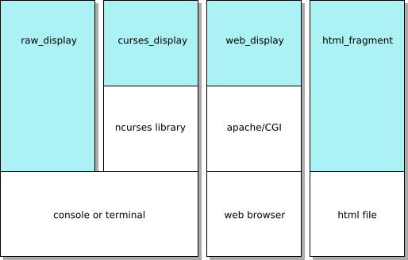

.. _display-modules:

*******************
  Display Modules
*******************

.. currentmodule:: urwid

Urwid's display modules provide a layer of abstraction for drawing to the
screen and reading user input. The display module you choose will depend on
how you plan to use Urwid.

Typically you will select a display module by passing it to your
:class:`MainLoop` constructor, eg:

::

    loop = MainLoop(widget, ..., screen=urwid.curses_display.Screen())

If you don't specify a display module, the default main loop will use
:class:`raw_display.Screen` by default

::

    # These are the same
    loop = MainLoop(widget, ...)
    loop = MainLoop(widget, ..., screen=urwid.raw_display.Screen())

Raw and Curses Display Modules
==============================

Urwid has two display modules for displaying to terminals or the console.

The :class:`raw_display.Screen` module is a pure-python display module with no
external dependencies. It sends and interprets terminal escape sequences
directly. This is the default display module used by
:class:`MainLoop`.

The :class:`curses_display.Screen` module uses the curses or ncurses library
provided by the operating system. The library does some optimization of screen
updates and uses termcap to adjust to the user's terminal.

The (n)curses library will disable colors if it detects a monochrome terminal,
so a separate set of attributes should be given for monochrome mode when
registering a palette with :class:`curses_display.Screen` High colors will not be
used by the :class:`curses_display.Screen` module. See :ref:`setting-a-palette`
below.

This table summarizes the differences between the two modules:

============================== =========== ==============
..                             raw_display curses_display
============================== =========== ==============
optimized C code               no          YES
compatible with any terminal   no          YES [1]_
UTF-8 support                  YES         YES [2]_
bright foreground without bold YES [3]_    no
88- or 256-color support       YES         no
mouse dragging support         YES         no
external event loop support    YES         no
============================== =========== ==============

.. [1] if the termcap entry exists and TERM environment variable is set
       correctly
.. [2] if python is linked against the wide version of ncurses
.. [3] when using xterm or gnome-terminal

Other Display Modules
=====================

CGI Web Display Module ``web_display``
--------------------------------------

The :mod:`urwid.web_display` module lets you run your application as a CGI
script under Apache instead of running it in a terminal.

This module is a proof of concept. There are security and responsiveness issues
that need to be resolved before this module is recommended for production use.

The tour.py_ and calc.py_ example programs demonstrate use of this module.

.. _tour.py: http://excess.org/urwid/browser/examples/tour.py
.. _calc.py: http://excess.org/urwid/browser/examples/calc.py

Screenshot Display Module ``html_fragment``
-------------------------------------------

Screenshots of Urwid interfaces can be rendered in plain HTML. The
:class:`html_fragment.HtmlGenerator` display module lets you do this by simulating user input
and capturing the screen as fragments of HTML each time
:meth:`html_fragemnt.HtmlGenerator.draw_screen` is
called.

These fragments may be included in HTML documents. They will be rendered
properly by any browser that uses a monospaced font for text that appears in
``<pre>`` tags. HTML screenshots have text that is searchable and selectable in
a web browser, and they will shrink and grow when a user changes their
browser's text size.

The `example screenshots`_ are generated with this display module.

.. _`example screenshots`: http://excess.org/urwid/examples.html

LCD Display Module ``lcd_display``
----------------------------------

Almost any device that displays characters in a grid can be used as a
screen.  The :mod:`lcd_display` module has some base classes for simple
LCD character display devices and a complete implementation of a
:class:`lcd_display.CF635Screen` for Crystal Fontz 635 USB displays with
6 buttons.

The lcd_cf635.py_ example program demonstrates use of this module.

.. _lcd_cf635.py: http://excess.org/urwid/browser/examples/lcd_cf635.py

.. seealso:: `Urwid on a Crystalfontz 635 LCD <http://excess.org/article/2010/03/urwid-crystalfontz-635-lcd/>`_

.. _setting-a-palette:

Setting a Palette
=================

The :class:`MainLoop` constructor takes a *palette* parameter that it passes
to the :meth:`register_palette() <BaseScreen.register_palette>` method of your display module.

A palette is a list of :ref:`display attribute <display-attributes>` names and foreground
and background settings. Display modules may be run in monochrome, normal or
high color modes and you can set different foregrounds and backgrounds for each
mode as part of your palette. eg:

::

    loop = MainLoop(widget, palette=[
        ('headings', 'white,underline', 'black', 'bold,underline'), # bold text in monochrome mode
        ('body_text', 'dark cyan', 'light gray'),
        ('buttons', 'yellow', 'dark green', 'standout'),
        ('section_text', 'body_text'), # alias to body_text
        ])

The :ref:`display-attributes` section of this manual describes all the options
available.
