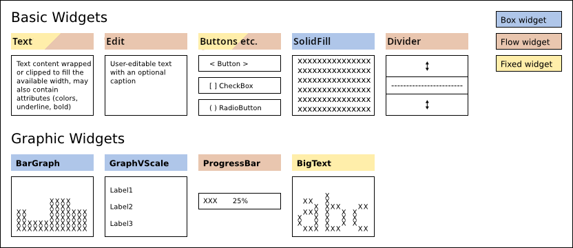

.. _basic-grafic-widgets:

********************
  Standard widgets
********************

Basic & Graphic Widgets
=======================

:ref:`Widget class reference <widget-classes>`

Basic and graphic widgets are the content with which users interact. They may
also be used as part of custom widgets you create.

Decoration & Container Widgets
==============================

.. image:: images/urwid_widgets_2.png

:ref:`Widget class reference <widget-classes>`

Decoration widgets alter the appearance or position of a single other widget.
The widget they wrap is available as the ``decoration_widget.original_widget``.
If you might be using more than one decoration widget you may use
``decoration_widget.base_widget`` to access the "most" original_widget
(``decoration_widget.original_widget.original_widget...``).
``widget.base_widget`` points to ``widget`` on all non-decoration widgets, so
it is safe to use in any situation.

Container widgets divide their available space between their child widgets.
This is how widget layouts are defined. When handling selectable widgets
container widgets also keep track of which of their child widgets is in focus.
Container widgets may be nested, so the actual widget in focus may be many
levels below the topmost widget.

Different container widgets have different methods of accessing and updating
their children, and the child in focus. These methods will be made more
consistent in a future release.
