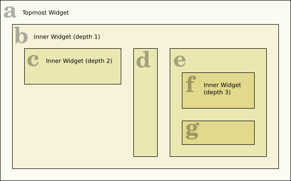
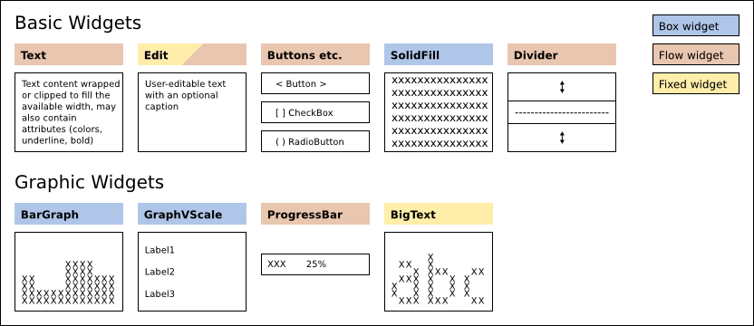
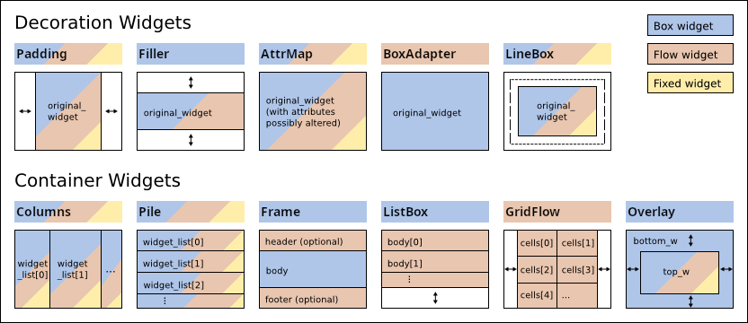

***********
  Widgets
***********

.. currentmodule:: urwid

.. _widget-layout:

Widget Layout
=============

Urwid uses widgets to divide up the available screen space. This makes it easy
to create a fluid interface that moves and changes with the user's terminal and
font size.

The result of rendering a widget is a canvas suitable for displaying on the
screen. When we render the topmost widget:

1. The topmost widget *(a)* is rendered the full size of the screen
2. *(a)* renders *(b)* any size up to the full size of the screen
3. *(b)* renders *(c)*, *(d)* and *(e)* dividing its available screen columns
   between them
4. *(e)* renders *(f)* and *(g)* dividing its available screen rows between
   them
5. *(e)* combines the canvases from *(f)* and *(g)* and returns them
6. *(b)* combines the canvases from *(c)*, *(d)* and *(e)* and returns them
7. *(a)* possibly modifies the canvas from *(b)* and returns it

Widgets *(a)*, *(b)* and *(e)* are called container widgets because they
contain other widgets. Container widgets choose the size and position of their
contained widgets.

Container widgets must also keep track of which one of their contained widgets
is in focus. The focus is used when handling keyboard input. If in the above
example *(b)* 's focus widget is *(e)* and *(e)* 's focus widget is
*(f)* then keyboard input will be handled this way:

1. The keypress is passed to the topmost widget *(a)*
2. *(a)* passes the keypress to *(b)*
3. *(b)* passes the keypress to *(e)*, its focus widget
4. *(e)* passes the keypress to *(f)*, its focus widget
5. *(f)* either handles the keypress or returns it
6. *(e)* has an opportunity to handle the keypress if it was returned from
   *(f)*
7. *(b)* has an opportunity to handle the keypress if it was returned from
   *(e)*
8. *(a)* has an opportunity to handle the keypress if it was returned from
   *(b)*

Box, Flow and Fixed Widgets
===========================

The size of a widget is measured in screen columns and rows. Widgets that are
given an exact number of screen columns and rows are called box widgets. The
topmost widget is always a box widget.

Much of the information displayed in a console user interface is text and the
best way to display text is to have it flow from one screen row to the next.
Widgets like this that require a variable number of screen rows are called flow
widgets. Flow widgets are given a number of screen columns and can calculate
how many screen rows they need.

Occasionally it is also useful to have a widget that knows how many screen
columns and rows it requires, regardless of the space available. This is
called a fixed widget.

.. list-table:: How a Widget's Size is Determined
   :widths: 20 40 40
   :header-rows: 1

   * - sizing mode
     - width
     - height
   * - ``'box'``
     - container decides
     - container decides
   * - ``'flow'``
     - container decides
     - widget's :meth:`rows() <Widget.rows>` method
   * - ``'fixed'``
     - widget's :meth:`pack() <Widget.pack>` method
     - widget's :meth:`pack() <Widget.pack>` method

It is an Urwid convention to use the variables :attr:`maxcol` and
:attr:`maxrow` to store a widget's size. Box widgets require both of ``(maxcol,
maxrow)`` to be specified.

Flow widgets expect a single-element tuple ``(maxcol,)`` instead because they
calculate their :attr:`maxrow` based on the :attr:`maxcol` value.

Fixed widgets expect the value ``()`` to be passed in to functions that take
a size because they know their :attr:`maxcol` and :attr:`maxrow` values.

.. _basic-grafic-widgets:

Included Widgets
================

:ref:`Widget class reference <widget-classes>`

Basic and graphic widgets are the content with which users interact. They may
also be used as part of custom widgets you create.

.. _decoration-widgets:

Decoration Widgets
==================

Decoration widgets alter the appearance or position of a single other widget.
The widget they wrap is available as the
:attr:`original_widget <WidgetDecoration.original_widget>` property.
If you might be using more than one decoration widget you may use the
:attr:`base_widget <WidgetDecoration.base_widget>` property to access the
"most" original_widget.
:attr:`Widget.base_widget` points to ``self`` on all non-decoration widgets, so
it is safe to use in any situation.

.. _container-widgets:

Container Widgets
=================

Container widgets divide their available space between their child widgets.
This is how widget layouts are defined. When handling selectable widgets
container widgets also keep track of which of their child widgets is in focus.
Container widgets may be nested, so the actual widget in focus may be many
levels below the topmost widget.

Urwid's container widgets have a common API you can use, regardless of the
container type.  Backwards compatibility is still maintained for the old
container-specific ways of accessing and modifying contents, but this API
is now the preferred way of modifying and traversing containers.

::

  container.focus

is a read-only property that returns the widget in focus for this container.
Empty containers and non-container widgets (that inherit from Widget)
return ``None``.

::

  container.focus_position

is a read/write property that provides access to the position of the
container's widget in focus.  This will often be an integer value but may be
any object.
:class:`Columns`, :class:`Pile`, :class:`GridFlow`, :class:`Overlay` and
:class:`ListBox` with a :class:`SimpleListWalker` or :class:`SimpleFocusListWalker`
as its body use integer positions.  :class:`Frame` uses ``'body'``, ``'header'``
and ``'footer'``;  :class:`ListBox` with a custom list walker will use the
positions the list walker returns.

Reading this value on an empty container or on any non-container widgets
(that inherit from Widget) raises an IndexError.  Writing to this property with
an invalid position will also raise an IndexError.  Writing a new value
automatically marks this widget to be redrawn and will be reflected in
``container.focus``.

::

  container.contents

is a read-only property (read/write in some cases) that provides access to a
mapping- or list-like object that contains the child widgets and the options
used for displaying those widgets in this container.  The mapping- or list-like
object always allows reading from positions with the usual ``__getitem__()``
method and may support assignment and deletion with ``__setitem__()`` and
``__delitem__()`` methods.  The values are ``(child widget, option)`` tuples.
When this object or its contents are modified the widget is automatically
flagged to be redrawn.

:class:`Columns`, :class:`Pile` and :class:`GridFlow` allow assigning an
iterable to ``container.contents`` to overwrite the values in
with the ones provided.

:class:`Columns`, :class:`Pile`, :class:`GridFlow`, :class:`Overlay` and
:class:`Frame` support ``container.contents`` item assignment and deletion.

::

  container.options(...)

is a method that returns options objects for use in items added to
``container.contents``.  The arguments are specific to the container type,
and generally match the ``__init__()`` arguments for the container.
The objects returned are currently tuples of strings and integers or ``None``
for containers without child widget options.  This method exists to allow
future versions of Urwid to add new options to existing containers.  Code
that expects the option tuples to remain the same size will fail when new
options are added, so defensive programming with options tuples is strongly
encouraged.

::

  container.__getitem__(x)
  # a.k.a.
  container[x]

is a short-cut method behaving identically to:
``container.contents[x][0].base_widget``.
Which means roughly "give me the child widget at position *x* and skip all
the decoration widgets wrapping it".  Decoration widgets include
:class:`Padding`, :class:`Filler`, :class:`AttrMap` etc.

::

  container.get_focus_path()

is a method that returns the focus position for this container *and* all child
containers along the path defined by their focus settings.  This list of
positions is the closest thing we have to the singular widget-in-focus in
other UI frameworks, because the ultimate widget in focus in Urwid depends
on the focus setting of all its parent container widgets.

::

  container.set_focus_path(p)

is a method that assigns to the focus_position property of each container
along the path given by the list of positions *p*.  It may be used to restore
focus to a widget as returned by a previous call to ``container.get_focus_path()``.

::

  container.get_focus_widgets()

is a method that returns the ``.focus`` values starting from this container
and proceeding along each child widget until reaching a leaf
(non-container) widget.

Note that the list does not contain the topmost container widget
(i.e., on which this method is called), but does include the
lowest leaf widget.

::

  container.__iter__()
  # typically
  for x in container: ...

  container.__reversed__()
  # a.k.a
  reversed(container)

are methods that allow iteration over the *positions* of this container.
Normally the order of the positions generated by __reversed__() will be the
opposite of __iter__().  The exception is the case of :class:`ListBox` with
certain custom list walkers, and the reason goes back to the original way list
walker interface was defined.  Note that a custom list walker might also generate
an unbounded number of positions, so care should be used with this interface and
:class:`ListBox`.

Pile Widgets
------------

:class:`Pile` widgets are used to combine multiple widgets by stacking them vertically.
A Pile can manage selectable widgets by keeping track
of which widget is in focus and it can handle moving the focus between widgets
when the user presses the *UP* and *DOWN* keys.
A Pile will also work well when used within a :class:`ListBox`.

A Pile is selectable only if its focus widget is selectable. If you create a
Pile containing one Text widget and one Edit widget the Pile will choose the
Edit widget as its default focus widget.

Columns Widgets
---------------

:class:`Columns` widgets may be used to arrange either flow widgets,
box widgets or fixed widgets horizontally into columns.
Columns widgets will manage selectable widgets by keeping track of which column is in focus and it can
handle moving the focus between columns when the user presses the *LEFT* and *RIGHT* keys.
Columns widgets also work well when used within a :class:`ListBox`.

Columns widgets are selectable only if the column in focus is selectable.
If a focus column is not specified the first selectable widget will be chosen as the
focus column.

GridFlow Widgets
----------------

The :class:`GridFlow` widget is a fixed/flow widget designed for use
with :class:`Button`, :class:`CheckBox` and :class:`RadioButton` widgets.
It renders all the widgets it contains the same width
and it arranges them from left to right and top to bottom.

The GridFlow widget uses Pile, Columns, Padding and Divider widgets to build a
display widget that will handle the keyboard input and rendering. When the
GridFlow widget is resized it regenerates the display widget to accommodate the
new space.

Overlay Widgets
---------------

The :class:`Overlay` widget is a box/flow/fixed widget that contains two other widgets.
The bottom widget is BOX rendered the full size of the Overlay widget
and the top widget is placed on top, obscuring an area of the bottom widget.
Widget sizing depends on the top widget sizing and sizing options.
This widget can be used to create effects such as overlapping "windows" or pop-up menus.

The Overlay widget always treats the top widget as the one in focus.
All keyboard input will be passed to the top widget.

If you want to use a flow widget for the bottom widget,
first wrap the flow widget with a :class:`Filler` widget.

Scrollable Widgets
==================
Scrollable widgets can scroll long content which normally not fit into the screen resolution.
Scrolling is normally supported using keyboard positioning keys and mouse wheel.

For scrolling is expected to be used :class:`ScrollBar` which accept any BOX widget supporting scrollable api.

ScrollBar Widget
----------------
The :class:`ScrollBar` widget draw optional scrollbar on the right or left side of widget if scrolling is required
(widget not fit in the desired amount of rows).
The widget is always rendered BOX and wrapped widget is also should be BOX.
In case of other widget types, they should be wrapped to support BOX sizing.

* :class:`Scrollable` make any FLOW or FIXED widget compatible with scrollable api.
* :class:`ListBox` can be used with :class:`ScrollBar` directly,
  all input is always handled by :class:`ListBox` and it's widgets.

Keyboard positioning keys and mouse wheel is used for scrolling if not handled by the wrapped widget.
Scrolling is done on per-line basis.

Scrollable Widget
-----------------
The :class:`Scrollable` widget is used to make  any FLOW or FIXED widget compatible with scrollable api by changing
target widget render and scrolling along full-size / columns defined sized widget.

Keyboard positioning keys and mouse wheel is used for scrolling if not handled by the wrapped widget.

.. note::
    :class:`Scrollable` do not recognize if selectable wrapped widget part visible or not
    if wrapped widget do not draw cursor.
    This means, keyboard input maybe forwarded to the wrapped selectable widget even if it not visible.
    **Mouse input is not affected by this limitation** due to known column and raw of mouse event.

Comparing to the :class:`ListBox`,
:class:`Scrollable` handles fixed and flow widgets directly instead of using list of small widgets.
:class:`ListBox` should be used to scroll between widgets, which can be multiline by itself.

.. _scrollable-api:

Scrollable API
--------------
Widget pretending to be scrolled via :class:`ScrollBar` should subclass :class:`Widget`
and implement positioning API:

.. currentmodule:: Scrollable

.. py:method:: get_scrollpos(size=None, focus=False)

    Get scrolling position

    :param size: widget render size. If `size` is not given, the currently rendered number of rows is returned.
    :type size: tuple[int, int] | None
    :param focus: widget is focused
    :type focus: bool
    :return: the index of the first visible row.
    :rtype: int

.. py:method:: set_scrollpos(position: SupportsInt)

    **Optional** method for setting scrolling position.

    Method is called on mouse wheel scroll if it implemented and mouse event was not handled by widget.

    If `position` is positive it is interpreted as lines from the top.
    If `position` is negative it is interpreted as lines from the bottom.

.. py:method:: rows_max(size=None, focus=False)

    Get the total number of rows `widget` can render.

    :param size: widget render size. If `size` is not given, the currently rendered number of rows is returned.
    :type size: tuple[int, int] | None
    :param focus: widget is focused
    :type focus: bool
    :return: the number of rows for `size`
    :rtype: int

.. currentmodule:: urwid

.. _listbox-contents:

ListBox Contents
================

:class:`ListBox` is a box widget that contains flow widgets.
Its contents are displayed stacked vertically, and the
:class:`ListBox` allows the user to scroll through its content.
One of the flow widgets displayed in the :class:`ListBox` is its
focus widget.

ListBox Focus and Scrolling
---------------------------

The :class:`ListBox` is a box widget that contains flow widgets.
Its contents are displayed stacked vertically, and the
:class:`ListBox` allows the user to scroll through its content.
One of the flow widgets displayed in the :class:`ListBox` is the
focus widget. The :class:`ListBox` passes key presses to the
focus widget to allow the user to interact with it. If the focus widget does
not handle a keypress then the :class:`ListBox` may handle the
keypress by scrolling and/or selecting another widget to become the focus
widget.

The :class:`ListBox` tries to do the most sensible thing when
scrolling and changing focus. When the widgets displayed are all
:class:`Text` widgets or other unselectable widgets then the
:class:`ListBox` will behave like a web browser does when the
user presses *UP*, *DOWN*, *PAGE UP* and *PAGE DOWN*: new text is immediately
scrolled in from the top or bottom. The :class:`ListBox` chooses
one of the visible widgets as its focus widget when scrolling. When scrolling
up the :class:`ListBox` chooses the topmost widget as the focus,
and when scrolling down the :class:`ListBox` chooses the
bottommost widget as the focus.

The :class:`ListBox` remembers the location of the widget in
focus as either an "offset" or an "inset". An offset is the number of rows
between the top of the :class:`ListBox` and the beginning of the
focus widget. An offset of zero corresponds to a widget with its top aligned
with the top of the :class:`ListBox`. An inset is the fraction
of rows of the focus widget that are "above" the top of the
:class:`ListBox` and not visible. The
:class:`ListBox` uses this method of remembering the focus
widget location so that when the :class:`ListBox` is resized the
text displayed will stay roughly aligned with the top of the
:class:`ListBox`.

When there are selectable widgets in the :class:`ListBox` the
focus will move between the selectable widgets, skipping the unselectable
widgets. The :class:`ListBox` will try to scroll all the rows of
a selectable widget into view so that the user can see the new focus widget in
its entirety. This behavior can be used to bring more than a single widget into
view by using composite widgets to combine a selectable widget with other
widgets that should be displayed at the same time.

Dynamic ListBox with ListWalker
-------------------------------

While the :class:`ListBox` stores the location of its focus
widget, it does not directly store the actual focus widget or other contents of
the :class:`ListBox`. The storage of a
:class:`ListBox`'s content is delegated to a "List Walker"
object. If a list of widgets is passed to the :class:`ListBox`
constructor then it creates a :class:`SimpleListWalker` object
to manage the list.

When the :class:`ListBox` is `rendering a canvas`_ or `handling
input`_ it will:

.. _rendering a canvas: :meth:`ListBox.render`
.. _handling input: :meth:`ListBox.keypress`

1. Call the :meth:`get_focus` method of its list walker object. This method
   will return the focus widget and a position object.
2. Optionally call the :meth:`get_prev` method of its List Walker object one or
   more times, initially passing the focus position and then passing the new
   position returned on each successive call. This method will return the
   widget and position object "above" the position passed.
3. Optionally call the :meth:`get_next` method of its List Walker object one or
   more times, similarly, to collect widgets and position objects "below" the
   focus position.
4. Optionally call the :meth:`set_focus` method passing one of the position
   objects returned in the previous steps.

This is the only way the :class:`ListBox` accesses its contents,
and it will not store copies of any of the widgets or position objects beyond
the current rendering or input handling operation.

The :class:`SimpleListWalker` stores a list of widgets, and uses
integer indexes into this list as its position objects. It stores the focus
position as an integer, so if you insert a widget into the list above the focus
position then you need to remember to increment the focus position in the
:class:`SimpleListWalker` object or the contents of the
:class:`ListBox` will shift.

A custom List Walker object may be passed to the
:class:`ListBox` constructor instead of a plain list of widgets.
List Walker objects must implement the :ref:`list-walker-interface`.

The fib.py_ example program demonstrates a custom list walker that doesn't
store any widgets. It uses a tuple of two successive Fibonacci numbers as its
position objects and it generates Text widgets to display the numbers on the
fly. The result is a :class:`ListBox` that can scroll through an
unending list of widgets.

The edit.py_ example program demonstrates a custom list walker that loads lines
from a text file only as the user scrolls them into view. This allows even
huge files to be opened almost instantly.

The browse.py_ example program demonstrates a custom list walker that uses a
tuple of strings as position objects, one for the parent directory and one for
the file selected. The widgets are cached in a separate class that is accessed
using a dictionary indexed by parent directory names. This allows the
directories to be read only as required. The custom list walker also allows
directories to be hidden from view when they are "collapsed".

.. _fib.py: https://github.com/urwid/urwid/blob/master/examples/fib.py
.. _edit.py: https://github.com/urwid/urwid/blob/master/examples/edit.py
.. _browse.py: https://github.com/urwid/urwid/blob/master/examples/browse.py

Setting the Focus
-----------------

The easiest way to change the current :class:`ListBox` focus is
to call the :meth:`ListBox.set_focus` method. This method doesn't
require that you know the :class:`ListBox`'s current dimensions
``(maxcol, maxrow)``. It will wait until the next call to either keypress or
render to complete setting the offset and inset values using the dimensions
passed to that method.

The position object passed to :meth:`set_focus` must be compatible with the
List Walker object that the :class:`ListBox` is using. For
:class:`SimpleListWalker` the position is the integer index of
the widget within the list.

The *coming_from* parameter should be set if you know that the old position is
"above" or "below" the previous position. When the
:class:`ListBox` completes setting the offset and inset values
it tries to find the old widget among the visible widgets. If the old widget is
still visible, if will try to avoid causing the :class:`ListBox`
contents to scroll up or down from its previous position. If the widget is not
visible, then the :class:`ListBox` will:

* Display the new focus at the bottom of the :class:`ListBox` if
  *coming_from* is "above".
* Display the new focus at the top of the :class:`ListBox` if
  *coming_from* is "below".
* Display the new focus in the middle of the :class:`ListBox` if
  coming_from is ``None``.

If you know exactly where you want to display the new focus widget within the
:class:`ListBox` you may call
:meth:`ListBox.set_focus_valign`.  This method lets you specify
the *top*, *bottom*, *middle*, a relative position or the exact number of rows
from the top or bottom of the :class:`ListBox`.

List Walkers
------------

:class:`ListBox` does not manage the widgets it displays
directly, instead it passes that task to a class called a "list walker". List
walkers keep track of the widget in focus and provide an opaque position object
that the :class:`ListBox` may use to iterate through widgets
above and below the focus widget.

A :class:`SimpleFocusListWalker`
is a list walker that behaves like a normal Python list. It may be used any
time you will be displaying a moderate number of widgets.

If you need to display a large number of widgets you should implement your own
list walker that manages creating widgets as they are requested and destroying
them later to avoid excessive memory use.

List walkers may also be used to display tree or other structures within a
:class:`ListBox`. A number of the `example programs
<http://excess.org/urwid/examples.html>`_ demonstrate the use of custom list
walker classes.

.. seealso:: :class:`ListWalker base class reference <ListWalker>`

.. _list-walker-interface:

List Walker Interface
---------------------

List Walker API Version 1
~~~~~~~~~~~~~~~~~~~~~~~~~

This API will remain available and is still the least restrictive option fo the programmer.
Your class should subclass :class:`ListWalker`.
Whenever the focus or content changes you are responsible for calling :meth:`ListWalker._modified`.

.. currentmodule:: MyV1ListWalker

.. method:: get_focus()

   return a ``(widget, position)`` tuple or ``(None, None)`` if empty

.. method:: set_focus(position)

   set the focus and call ``self._modified()`` or raise an :exc:`IndexError`.

.. method:: get_next(position)

   return the ``(widget, position)`` tuple below *position* passed
   or ``(None, None)`` if there is none.

.. method:: get_prev(position)

   return the ``(widget, position)`` tuple above *position* passed
   or ``(None, None)`` if there is none.

List Walker API Version 2
~~~~~~~~~~~~~~~~~~~~~~~~~

This API is an attempt to remove some of the duplicate code that V1 requires for
many users.  List walker API V1 will be implemented automatically by
subclassing :class:`ListWalker` and implementing the V2 methods.
Whenever the focus or content changes you are responsible for
calling :meth:`ListWalker._modified`.

.. currentmodule:: MyV2ListWalker

.. method:: __getitem__(position)

   return widget at *position* or raise an :exc:`IndexError` or :exc:`KeyError`

.. method:: next_position(position)

   return the position below passed *position* or raise an :exc:`IndexError` or :exc:`KeyError`

.. method:: prev_position(position)

   return the position above passed *position* or raise an :exc:`IndexError` or :exc:`KeyError`

.. method:: set_focus(position)

   set the focus and call ``self._modified()`` or raise an :exc:`IndexError`.

.. attribute:: focus

   attribute or property containing the focus position, or define
   :meth:`MyV1ListWalker.get_focus` as above

List Walker Iteration
~~~~~~~~~~~~~~~~~~~~~

There is an optional iteration helper method that may be defined in any list walker.
When this is defined it will be used by :meth:`ListBox.__iter__` and
:meth:`ListBox.__reversed__`:

.. method:: positions(reverse=False)

   return a forward or reverse iterable of positions

.. currentmodule:: urwid

Custom Widgets
==============

Widgets in Urwid are easiest to create by extending other widgets. If you are
making a new type of widget that can use other widgets to display its content,
like a new type of button or control, then you should start by extending
:class:`WidgetWrap` and passing the display widget to its constructor.

The :class:`Widget` interface is described in detail in the
:class:`Widget base class reference <Widget>` and is useful if you're looking to modify
the behavior of an existing widget,
build a new widget class from scratch or just want a better understanding of
the library.

One Urwid design choice that stands out is that widgets typically have no
size. Widgets don't store their size on screen, and instead are
passed that information when they need it.

This choice has some advantages:

* widgets may be reused in different locations
* reused widgets only need to be rendered once per size displayed
* widgets don't need to know their parents
* less data to store and update
* no worrying about widgets that haven't received their size yet
* same widgets could be displayed at different sizes to different users
  simultaneously

It also has disadvantages:

* difficult to determine a widget's size on screen
* more parameters to parse
* duplicated size calculations across methods

For determining a widget's size on screen it is possible to look up the size(s)
it was rendered at in the :class:`CanvasCache`. There are plans
to address some of the duplicated size handling code in the container widgets
in a future Urwid release.

The same holds true for a widget's focus state, so that too is passed in to
functions that need it.

Modifying Existing Widgets
--------------------------

The easiest way to create a custom widget is to modify an existing widget.
This can be done by either subclassing the original widget or by wrapping it.
Subclassing is appropriate when you need to interact at a very low level with
the original widget, such as if you are creating a custom edit widget with
different behavior than the usual Edit widgets. If you are creating a custom
widget that doesn't need tight coupling with the original widget then
wrapping is more appropriate.

The :class:`WidgetWrap` class simplifies wrapping existing
widgets. You can create a custom widget simply by creating a subclass of
WidgetWrap and passing a widget into WidgetWrap's constructor.

This is an example of a custom widget that uses WidgetWrap:

.. literalinclude:: wmod.py
   :linenos:

The above code creates a group of RadioButtons and provides a method to
query the state of the buttons.

Widgets from Scratch
--------------------

Widgets must inherit from :class:`Widget`.
Box widgets must implement :meth:`Widget.selectable` and :meth:`Widget.render`
methods, and flow widgets must implement :meth:`Widget.selectable`,
:meth:`Widget.render` and :meth:`Widget.rows` methods.

The default :meth:`Widget.sizing` method returns a set of sizing modes supported
from ``self._sizing``, so we define ``_sizing`` attributes for our flow and
box widgets below.

.. literalinclude:: wanat.py
   :linenos:

The above code implements two widget classes. Pudding is a flow widget and
BoxPudding is a box widget. Pudding will render as much "Pudding" as will fit
in a single row, and BoxPudding will render as much "Pudding" as will fit into
the entire area given.

Note that the rows and render methods' focus parameter must have a default
value of False. Also note that for flow widgets the number of rows returned by
the rows method must match the number of rows rendered by the render method.

To improve the efficiency of your Urwid application you should be careful of
how long your ``rows()`` methods take to execute. The ``rows()`` methods may be called many
times as part of input handling and rendering operations. If you are using a
display widget that is time consuming to create you should consider caching it
to reduce its impact on performance.

It is possible to create a widget that will behave as either a flow widget or
box widget depending on what is required:

.. literalinclude:: wanat_multi.py
   :linenos:

MultiPudding will work in place of either Pudding or BoxPudding above. The
number of elements in the size tuple determines whether the containing widget
is expecting a flow widget or a box widget.

Selectable Widgets
------------------

Selectable widgets such as Edit and Button widgets allow the user to interact
with the application. A widget is selectable if its selectable method returns
True. Selectable widgets must implement the :meth:`Widget.keypress` method to
handle keyboard input.

.. literalinclude:: wsel.py

The SelectablePudding widget will display its contents in uppercase when it is
in focus, and it allows the user to "eat" the pudding by pressing each of the
letters *P*, *U*, *D*, *D*, *I*, *N* and *G* on the keyboard. When the user has
"eaten" all the pudding the widget will reset to its initial state.

Note that keys that are unhandled in the keypress method are returned so that
another widget may be able to handle them. This is a good convention to follow
unless you have a very good reason not to. In this case the *UP* and *DOWN*
keys are returned so that if this widget is in a
:class:`ListBox` the :class:`ListBox` will behave
as the user expects and change the focus or scroll the
:class:`ListBox`.

Widget Displaying the Cursor
----------------------------

Widgets that display the cursor must implement the
:meth:`Widget.get_cursor_coords` method.
Similar to the rows method for flow widgets, this method lets other widgets
make layout decisions without rendering the entire widget. The
:class:`ListBox` widget in particular uses get_cursor_coords to
make sure that the cursor is visible within its focus widget.

.. literalinclude:: wcur1.py
   :linenos:

CursorPudding will let the user move the cursor through the widget by pressing
*LEFT* and *RIGHT*. The cursor must only be added to the canvas when the widget
is in focus. The get_cursor_coords method must always return the same cursor
coordinates that render does.

A widget displaying a cursor may choose to implement :meth:`Widget.get_pref_col`.
This method
returns the preferred column for the cursor, and is called when the focus is
moving up or down off this widget.

Another optional method is :meth:`Widget.move_cursor_to_coords`. This method allows other
widgets to try to position the cursor within this widget. The
:class:`ListBox` widget uses :meth:`Widget.move_cursor_to_coords` when
changing focus and when the user pressed *PAGE UP* or *PAGE DOWN*. This method
must return ``True`` on success and ``False`` on failure. If the cursor may be
placed at any position within the row specified (not only at the exact column
specified) then this method must move the cursor to that position and return
``True``.

.. literalinclude:: wcur2.py
   :linenos:
   :lines: 7-

Widget Metaclass
================

The :class:`Widget` base class has a metaclass defined that
creates a ``__super`` attribute for calling your superclass:
``self.__super`` is the same as the usual ``super(MyClassName, self)``.
This shortcut is of little use with Python 3's new ``super()`` syntax, but
will likely be retained for backwards compatibility in future versions.

This metaclass also uses :class:`MetaSignal`
to allow signals to be defined as a list of signal names
in a ``signals`` class attribute.  This is equivalent to calling
:func:`register_signal` with the class name and list of signals and all those
defined in superclasses after the class definition.

.. seealso::

    :class:`Widget metaclass WidgetMeta <WidgetMeta>`

