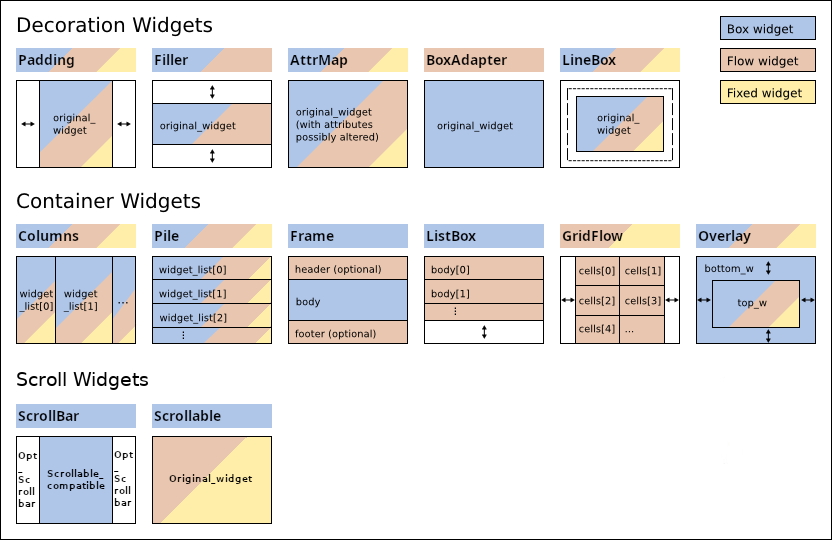

***********
  Widgets
***********

.. currentmodule:: urwid

.. _widget-layout:

Widget Layout
=============

Urwid uses widgets to divide up the available screen space. This makes it easy
to create a fluid interface that moves and changes with the user's terminal and
font size.

.. image:: images/widget_layout.png

The result of rendering a widget is a canvas suitable for displaying on the
screen. When we render the topmost widget:

1. The topmost widget *(a)* is rendered the full size of the screen
2. *(a)* renders *(b)* any size up to the full size of the screen
3. *(b)* renders *(c)*, *(d)* and *(e)* dividing its available screen columns
   between them
4. *(e)* renders *(f)* and *(g)* dividing its available screen rows between
   them
5. *(e)* combines the canvases from *(f)* and *(g)* and returns them
6. *(b)* combines the canvases from *(c)*, *(d)* and *(e)* and returns them
7. *(a)* possibly modifies the canvas from *(b)* and returns it

Widgets *(a)*, *(b)* and *(e)* are called container widgets because they
contain other widgets. Container widgets choose the size and position their
contained widgets.

Container widgets must also keep track of which one of their contained widgets
is in focus. The focus is used when handling keyboard input. If in the above
example *(b)* 's focus widget is *(e)* and *(e)* 's focus widget is
*(f)* then keyboard input will be handled this way:

1. The keypress is passed to the topmost widget *(a)*
2. *(a)* passes the keypress to *(b)*
3. *(b)* passes the keypress to *(e)*, its focus widget
4. *(e)* passes the keypress to *(f)*, its focus widget
5. *(f)* either handles the keypress or returns it
6. *(e)* has an opportunity to handle the keypress if it was returned from
   *(f)*
7. *(b)* has an opportunity to handle the keypress if it was returned from
   *(e)*
8. *(a)* has an opportunity to handle the keypress if it was returned from
   *(b)*

Box, Flow and Fixed Widgets
===========================

The size of a widget is measured in screen columns and rows. Widgets that are
given an exact number of screen columns and rows are called box widgets. The
topmost widget is always a box widget.

Much of the information displayed in a console user interface is text and the
best way to display text is to have it flow from one screen row to the next.
Widgets like this that require a variable number of screen rows are called flow
widgets. Flow widgets are given a number of screen columns and can calculate
how many screen rows they need.

Occasionally it is also useful to have a widget that knows how many screen
columns and rows it requires, regardless of the space available. This is
called a fixed widget.

It is an Urwid convention to use the variables :attr:`maxcol` and
:attr:`maxrow` to store a widget's size. Box widgets require both of ``(maxcol,
maxrow)`` to be specified.

Flow widgets expect a single-element tuple ``(maxcol,)`` instead because they
calculate their :attr:`maxrow` based on the :attr:`maxcol` value.

Fixed widgets expect the value ``()`` to be passed in to functions that take
a size because they know their :attr:`maxcol` and :attr:`maxrow` values.
.. _basic-grafic-widgets:

Included Basic & Graphic Widgets
================================

.. image:: images/urwid_widgets_1.png

:ref:`Widget class reference <widget-classes>`

Basic and graphic widgets are the content with which users interact. They may
also be used as part of custom widgets you create.

Included Decoration & Container Widgets
=======================================

:ref:`Widget class reference <widget-classes>`

Decoration widgets alter the appearance or position of a single other widget.
The widget they wrap is available as the
:attr:`original_widget <WidgetDecoration.original_widget>` property.
If you might be using more than one decoration widget you may use the
:attr:`base_widget <WidgetDecoration.base_widget>` property to access the
"most" original_widget.
:attr:`Widget.base_widget` points to ``self`` on all non-decoration widgets, so
it is safe to use in any situation.

Container widgets divide their available space between their child widgets.
This is how widget layouts are defined. When handling selectable widgets
container widgets also keep track of which of their child widgets is in focus.
Container widgets may be nested, so the actual widget in focus may be many
levels below the topmost widget.

Customizing Widgets
===================

Widgets in Urwid are easiest to create by extending other widgets. If you are
making a new type of widget that can use other widgets to display its content,
like a new type of button or control, then you should start by extending
:class:`WidgetWrap` and passing the display widget to its constructor.

The :class:`Widget` interface is described in detail in the
:class:`Widget base class reference <Widget>` and is useful if you're looking to modify
the behavior of an existing widget,
build a new widget class from scratch or just want a better understanding of
the library.

One Urwid design choice that stands out is that widgets typically have no
size. Widgets don't store their size on screen, and instead are
passed that information when they need it.

This choice has some advantages:

* widgets may be reused in different locations
* reused widgets only need to be rendered once per size displayed
* widgets don't need to know their parents
* less data to store and update
* no worrying about widgets that haven't received their size yet
* same widgets could be displayed at different sizes to different users
  simultaneously

It also has disadvantages:

* difficult to determine a widget's size on screen
* more parameters to parse
* duplicated size calculations across methods

For determining a widget's size on screen it is possible to look up the size(s)
it was rendered at in the :class:`CanvasCache`. There are plans
to address some of the duplicated size handling code in the container widgets
in a future Urwid release.

The same holds true for a widget's focus state, so that too is passed in to
functions that need it.

The :class:`Widget` base class has some metaclass magic that
creates a ``__super`` attribute for calling your superclass:
``self.__super`` is the same as the usual ``super(MyClassName, self)``.
This shortcut is of little use with Python 3's new ``super()`` syntax, but
will likely be retained for backwards compatibility in future versions.

.. seealso::

    :class:`Widget base class reference <Widget>`

