.. _urwid-tutorial:

******************
  Urwid Tutorial
******************

.. currentmodule:: urwid

Minimal Application
-------------------

.. image:: minimal1.png

This program displays the string ``Hello World`` in the top left corner of the
screen and will run until interrupted with *CTRL+C* (*^C*).

.. literalinclude:: minimal.py
   :linenos:

* The *txt* :class:`Text` widget handles formatting blocks of text,
  wrapping to the next line when necessary. Widgets like this are called "flow
  widgets" because their sizing can have a number of columns given, in this
  case the full screen width, then they will flow to fill as many rows as
  necessary.

* The *fill* :class:`Filler` widget fills in blank lines above or
  below flow widgets so that they can be displayed in a fixed number of rows.
  This Filler will align our Text to the top of the screen, filling all the
  rows below with blank lines. Widgets which are given both the number of
  columns and number of rows they must be displayed in are called "box
  widgets".

* The :class:`MainLoop` class handles displaying our widgets as
  well as accepting input from the user.
  The widget passed to :class:`MainLoop` is called the "topmost" widget.
  The topmost widget is used to render the whole screen and so it must be a box widget.
  In this case our widgets can't handle any user input so we need to interrupt
  the program to exit with *^C*.

Global Input
------------

.. image:: input1.png
.. image:: input2.png

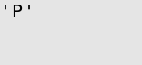

This program initially displays the string ``Hello World``, then it displays
each key pressed, exiting when the user presses *Q*.

.. literalinclude:: input.py
   :linenos:

* The :class:`MainLoop` class has an optional function
  parameter *unhandled_input*. This function will be called once for each
  keypress that is not handled by the widgets being displayed.
  Since none of the widgets being displayed here handle input, every key the user
  presses will be passed to the *show_or_exit* function.

* The :exc:`ExitMainLoop` exception is used to exit
  cleanly from the :meth:`MainLoop.run` function when the user
  presses *Q*. All other input is displayed by replacing the current Text
  widget's content.

Display Attributes
------------------

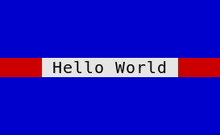
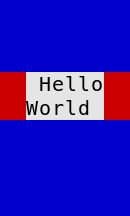
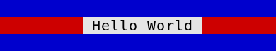
.. image:: urwid_attr4.png

This program displays the string ``Hello World`` in the center of the screen.
It uses different attributes for the text, the space on either side of the text
and the space above and below the text. It waits for a keypress before exiting.

The screenshots above show how these widgets react to being resized.

.. literalinclude:: urwid_attr.py
   :linenos:

* Display attributes are defined as part of a palette. Valid foreground,
  background and
  setting values are documented in :ref:`foreground-background`
  A palette is a list of tuples containing:

    1. Name of the display attribute, typically a string
    2. Foreground color and settings for 16-color (normal) mode
    3. Background color for normal mode
    4. Settings for monochrome mode (optional)
    5. Foreground color and settings for 88 and 256-color modes (optional, see
       next example)
    6. Background color for 88 and 256-color modes (optional)

* A :class:`Text` widget is created containing the string ``" Hello World "``
  with display attribute ``'banner'``. The attributes of text in a Text widget is
  set by using a (*attribute*, *text*) tuple instead of a simple text string.
  Display attributes will flow with the text, and multiple display attributes may be
  specified by combining tuples into a list. This format is called :ref:`text-markup`.

* An :class:`AttrMap` widget is created to wrap the text
  widget with display attribute ``'streak'``. :class:`AttrMap` widgets
  allow you to map any display attribute to any other display attribute, but by default they
  will set the display attribute of everything that does not already have a display attribute.
  In this case the text has an attribute, so only the areas around the text
  used for alignment will have the new attribute.

* A second :class:`AttrMap` widget is created to wrap the
  :class:`Filler` widget with attribute ``'bg'``.

When this program is run you can now clearly see the separation of the text,
the alignment around the text, and the filler above and below the text.

.. seealso:: :ref:`using-display-attributes`

High Color Modes
----------------

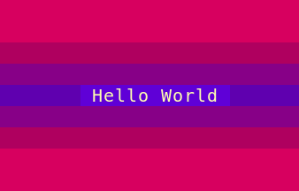

This program displays the string ``Hello World`` in the center of the screen.
It uses a number of 256-color-mode colors to decorate the text,
and will work in any terminal that supports 256-color mode. It will exit when
*Q* is pressed.

.. literalinclude:: highcolors.py
   :linenos:

This palette only defines values for the high color foreground and
backgrounds, because only the high colors will be used. A real application
should define values for all the modes in their palette. Valid foreground,
background and setting values are documented in :ref:`foreground-background`.

* Behind the scenes our :class:`MainLoop` class has created a
  :class:`raw_display.Screen` object for drawing the screen. The program
  is put into 256-color mode by using the screen object's
  :meth:`set_terminal_properties() <raw_display.Screen.set_terminal_properties>` method.

This example also demonstrates how you can build the widgets to display
in a top-down order instead of the usual bottom-up order. In some
places we need to use a *placeholder* widget because we must provide
a widget before the correct one has been created.

* We change the topmost widget used by the :class:`MainLoop` by
  assigning to its :attr:`MainLoop.widget` property.

* :ref:`decoration-widgets` like :class:`AttrMap` have an
  ``original_widget`` property that we can assign to change the widget they wrap.

* :class:`Divider` widgets are used to create blank lines,
  colored with :class:`AttrMap`.

* :ref:`container-widgets` like :class:`Pile` have a
  ``contents`` property that we can treat like a list of
  (*widget*, *options*) tuples.  :attr:`Pile.contents` supports normal list
  operations including ``append()`` to add child widgets.
  :meth:`Pile.options` is used to generate the default options
  for the new child widgets.

Question and Answer
-------------------

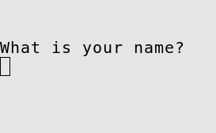
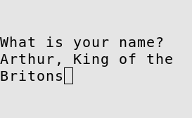
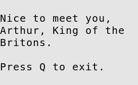

This program asks for your name then responds ``Nice to meet you, (your
name).``

.. literalinclude:: qa.py
   :linenos:

The :class:`Edit` widget is based on the :class:`Text` widget but it accepts
keyboard input for entering text, making corrections and
moving the cursor around with the *HOME*, *END* and arrow keys.

Here we are customizing the :class:`Filler` decoration widget that is holding
our :class:`Edit` widget by subclassing it and defining a new ``keypress()``
method.  Customizing decoration or container widgets to handle input this way
is a common pattern in Urwid applications.  This pattern is easier to maintain
and extend than handling all special input in an *unhandled_input* function.

* In *QuestionBox.keypress()* all keypresses except *ENTER* are passed along to
  the default :meth:`Filler.keypress` which sends them to the
  child :meth:`Edit.keypress` method.
* Note that names containing *Q* can be entered into the :class:`Edit`
  widget without causing the program to exit because :meth:`Edit.keypress`
  indicates that it has handled the key by returning ``None``.
  See :meth:`Widget.keypress` for more information.
* When *ENTER* is pressed the child widget ``original_widget`` is changed
  to a :class:`Text` widget.
* :class:`Text` widgets don't handle any keyboard input so all input
  ends up in the *unhandled_input* function *exit_on_q*, allowing the
  user to exit the program.

Signal Handlers
---------------

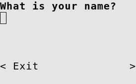
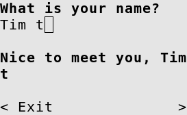
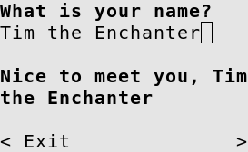
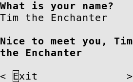

This program asks for your name and responds ``Nice to meet you, (your name)``
*while* you type your name.  Press *DOWN* then *SPACE* or *ENTER* to exit.

.. literalinclude:: sig.py
   :linenos:

* An :class:`Edit` widget and a :class:`Text` reply
  widget are created, like in the previous example.
* The :func:`connect_signal` function is used to attach our
  *on_ask_change()* function to our :class:`Edit` widget's
  ``'change'`` signal. Now any time the content of the :class:`Edit`
  widget changes *on_ask_change()* will be called and passed the new
  content.
* Finally we attach our *on_exit_clicked()* function to our
  exit :class:`Button`'s ``'click'`` signal.
* *on_ask_change()* updates the reply text as the user enters their
  name and *on_exit_click()* exits.

Multiple Questions
------------------

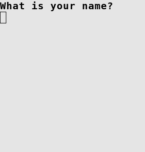
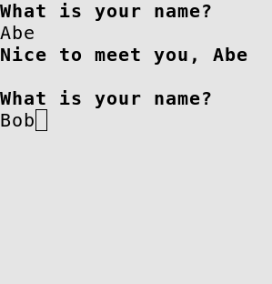
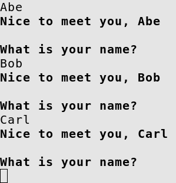
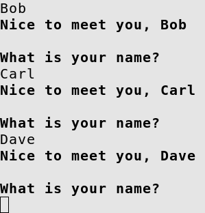

This program asks for your name and responds ``Nice to meet you, (your name).``
It then asks again, and again. Old values may be changed and the responses will
be updated when you press *ENTER*. *ENTER* on a blank line exits.

.. literalinclude:: multiple.py
   :linenos:

:class:`ListBox` widgets let you scroll through a number of flow widgets
vertically.  It handles *UP*, *DOWN*, *PAGE UP* and *PAGE DOWN* keystrokes
and changing the focus for you.  :ref:`listbox-contents` are managed by
a "list walker", one of the list walkers that is easiest to use is
:class:`SimpleFocusListWalker`.

:class:`SimpleFocusListWalker` is like a normal python list of widgets, but
any time you insert or remove widgets the focus position is updated
automatically.

Here we are customizing our :class:`ListBox`'s keypress handling by overriding
it in a subclass.

* The *question()* function is used to build widgets to communicate with the user.
  Here we return a :class:`Pile` widget with a single :class:`Edit` widget
  to start.
* We retrieve the name entered with :attr:`ListBox.focus` to get the
  :class:`Pile` in focus, the standard
  :ref:`container widget <container-widgets>` method ``[0]`` to get the
  first child of the pile and :attr:`Edit.edit_text` to get the user-entered
  text.
* For the response we use the fact that we can treat
  :attr:`Pile.contents` like a list of (*widget*, *options*) tuples to create or
  replace any existing response by assigning a one-tuple list to *contents[1:]*.  We create
  the default options using :meth:`Pile.options`.
* To add another question after the current one we treat our
  :class:`SimpleFocusListWalker` stored as :attr:`ListBox.body` like a normal
  list of widgets by calling *insert()*, then update the focus position to the widget we just
  created.

Simple Menu
-----------

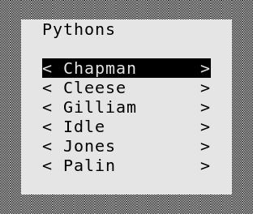
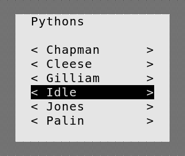
.. image:: smenu3.png

We can create a very simple menu using a list of :class:`Button` widgets.
This program lets you choose an option then repeats what you chose.

.. literalinclude:: smenu.py
   :linenos:

* *menu()* builds a :class:`ListBox` with a *title* and a sequence of :class:`Button`
  widgets.  Each button has its ``'click'`` signal attached to *item_chosen*,
  with item name is passed as data.
  The buttons are decorated with an :class:`AttrMap` that applies
  a display attribute when a button is in focus.
* *item_chosen()* replaces the menu displayed with text indicating the users'
  choice.
* *exit_program()* causes the program to exit on any keystroke.
* The menu is created and decorated with an :class:`Overlay` using a
  :class:`SolidFill` as the background.  The :class:`Overlay` is given a
  miniumum width and height but is allowed to expand to 60% of the available
  space if the user's terminal window is large enough.

Cascading Menu
--------------

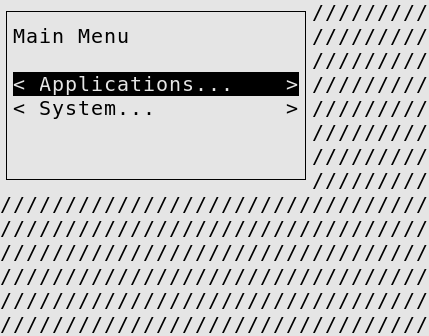
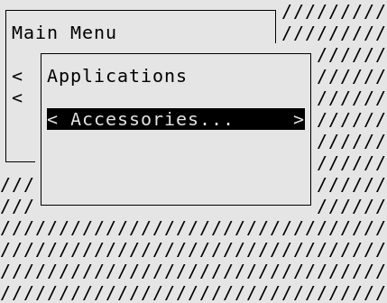
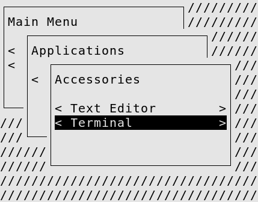
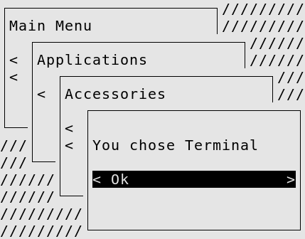

A nested menu effect can be created by having some buttons open new menus.  This program
lets you choose an option from a nested menu that cascades across the screen.  You may
return to previous menus by pressing *ESC*.

.. literalinclude:: cmenu.py
   :linenos:

* *menu_button()* returns an :class:`AttrMap`-decorated :class:`Button`
  and attaches a *callback* to its ``'click'`` signal.  This function is
  used for both sub-menus and final selection buttons.
* *sub_menu()* creates a menu button and a closure that will open the
  menu when that button is clicked.  Notice that
  :ref:`text markup <text-markup>` is used to add ``'...'`` to the end of
  the *caption* passed to *menu_button()*.
* *menu()* builds a :class:`ListBox` with a *title* and a sequence of widgets.
* *item_chosen()* displays the users' choice similar to the previous example.
* *menu_top* is the top level menu with all of its child menus and
  options built using the functions above.

This example introduces :class:`WidgetPlaceholder`. :class:`WidgetPlaceholder` is a
:ref:`decoration widget <decoration-widgets>` that does nothing to the widget it
decorates.  It is useful if you need a simple way to replace a widget that doesn't
involve knowing its position in a :ref:`container <container-widgets>`, or in this
case as a base class for a widget that will be replacing its own contents regularly.

* *CascadingBoxes* is a new widget that extends :class:`WidgetPlaceholder`.
  It provides an *open_box()* method that displays a box widget *box* "on top of"
  all the previous content with an :class:`Overlay` and a :class:`LineBox`.
  The position of each successive box is shifted right and down from the
  previous one.
* *CascadingBoxes.keypress()* intercepts *ESC* keys to cause the current box
  to be removed and the previous one to be shown.  This allows the user to
  return to a previous menu level.

Horizontal Menu
---------------

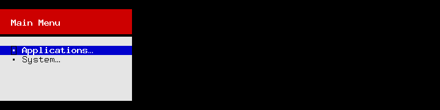
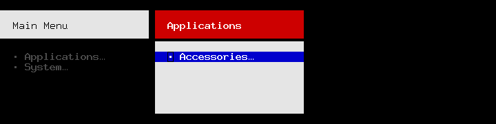
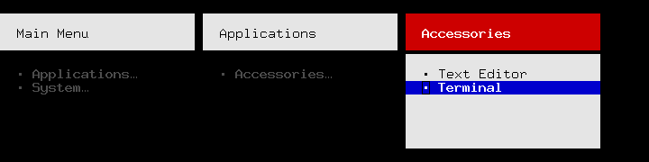
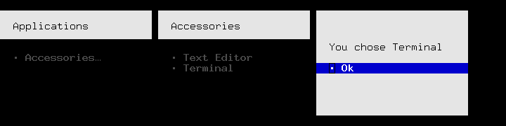

This example is like the previous but new menus appear on the right and push
old menus off the left side of the screen.
The look of buttons and other menu elements are heavily customized
and new widget classes are used instead of factory functions.

.. literalinclude:: hmenu.py
   :linenos:

* *MenuButton* is a customized :class:`Button` widget.  :class:`Button` uses
  :class:`WidgetWrap` to create its appearance and this class replaces the
  display widget created by :class:`Button` by the wrapped widget in
  *self._w*.
* *SubMenu* is implemented with a *MenuButton* but uses :class:`WidgetWrap`
  to hide the implementation instead of inheriting from *MenuButton*.
  The constructor builds a widget for the menu that this button will open
  and stores it in *self.menu*.
* *Choice* is like *SubMenu* but displays the item chosen instead of
  another menu.

The *palette* used in this example includes an entry with the special name
``None``.  The foreground and background specified in this entry are used
as a default when no other display attribute is specified.

* *HorizontalBoxes* arranges the menus displayed similar to the previous
  example.  There is no special handling required for going to previous
  menus here because :class:`Columns` already handles switching focus
  when *LEFT* or *RIGHT* is pressed.  :class:`AttrMap` with the *focus_map*
  dict is used to change the appearance of a number of the display attributes
  when a menu is in focus.

Adventure Game
--------------

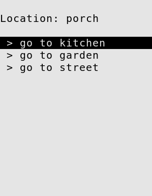
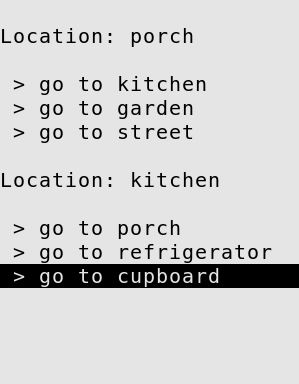
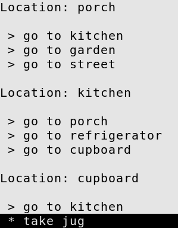
.. image:: adventure4.png

We can use the same sort of code to build a simple adventure game.  Instead
of menus we have "places" and instead of submenus and parent menus we just
have "exits".  This example scrolls previous places off the top of the
screen, allowing you to scroll back to view but not interact with previous
places.

.. literalinclude:: adventure.py
   :linenos:

This example starts to show some separation between the application logic
and the widgets that have been created.  The *AdventureGame* class is
responsible for all the changes that happen through the game and manages
the topmost widget, but isn't a widget itself.  This is a good pattern to
follow as your application grows larger.
