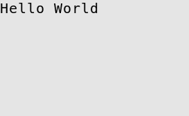
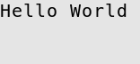
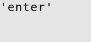
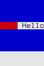
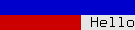

.. _urwid-tutorial:

******************
  Urwid Tutorial
******************

.. currentmodule:: urwid

Hello World Example
===================

Minimal Urwid Application
-------------------------

This program displays the string ``Hello World`` in the top left corner of the
screen and will run until interrupted with *CTRL+C* (*^C*).

.. literalinclude:: minimal.py
   :linenos:

* The *txt* :class:`Text` widget handles formatting blocks of text,
  wrapping to the next line when necessary. Widgets like this are called "flow
  widgets" because their sizing can have a number of columns given, in this
  case the full screen width, then they will flow to fill as many rows as
  necessary.

* The *fill* :class:`Filler` widget fills in blank lines above or
  below flow widgets so that they can be displayed in a fixed number of rows.
  This Filler will align our Text to the top of the screen, filling all the
  rows below with blank lines. Widgets which are given both the number of
  columns and number of rows they must be displayed in are called "box
  widgets". The "topmost" widget displayed on the screen must be a box widget.

* The :class:`MainLoop` class handles displaying our widgets as
  well as accepting input from the user. In this case our widgets can't handle
  the input so we need to interrupt the program to exit with *^C*.

Handling Input Globally
-----------------------

This program initially displays the string ``Hello World``, then it displays
each key pressed, exiting when the user presses *Q*.

.. literalinclude:: input.py
   :linenos:

* The :class:`MainLoop` class has an optional function
  parameter *unhandled_input* This function will be called once for each
  keypress that is not handled by the widgets being displayed.
  Since of the widgets being displayed here handle input, every key the user
  presses will be passed to the *show_or_exit* function.

* The :exc:`ExitMainLoop` exception is used to exit
  cleanly from the :meth:`MainLoop.run` function when the user
  presses *Q*. All other input is displayed by replacing the current Text
  widget's content.

.. image:: input3.png
.. image:: input4.png
.. image:: input5.png

AttrMap Widgets and Display Attributes
--------------------------------------

This program displays the string ``Hello World`` in the center of the screen.
It uses different attributes for the text, the space on either side of the text
and the space above and below the text. It waits for a keypress before exiting.

.. literalinclude:: attr.py
   :linenos:

* Display attributes are defined as part of a palette. Valid foreground,
  background and
  setting values are documented in :ref:`foreground-background`
  A palette is a list of tuples containing:

    1. Name of the display attribute, typically a string
    2. Foreground color and settings for 16-color (normal) mode
    3. Background color for normal mode
    4. Settings for monochrome mode (optional)
    5. Foreground color and settings for 88 and 256-color modes (optional, see
       next example)
    6. Background color for 88 and 256-color modes (optional)

* A :class:`Text` widget is created containing the string ``" Hello World "``
  with display attribute ``'banner'``. The attributes of text in a Text widget is
  set by using a ``(attribute, text)`` tuple instead of a simple text string.
  Display attributes will flow with the text, and multiple display attributes may be
  specified by combining tuples into a list. This format is called :ref:`text-markup`.

* An :class:`AttrMap` widget is created to wrap the text
  widget with display attribute ``'streak'``. :class:`AttrMap` widgets
  allow you to map any display attribute to any other display attribute, but by default they
  will set the display attribute of everything that does not already have a display attribute.
  In this case the text has an attribute, so only the areas around the text
  used for alignment will be have the new attribute.

* A second :class:`AttrMap` widget is created to wrap the
  :class:`Filler` widget with attribute ``'bg'``.

When this program is run you can now clearly see the separation of the text,
the alignment around the text, and the filler above and below the text. This
is how these widgets react to being resized:

.. seealso:: :ref:`using-display-attributes`

High Color Modes and Building Top-Down
--------------------------------------

This program displays the string ``Hello World`` in the center of the screen.
It uses a number of 256-color-mode colors to decorate the text,
and will work in any terminal that supports 256-color mode. It will exit when
*Q* is pressed.

.. literalinclude:: highcolors.py
   :linenos:

This palette only defines values for the high color foregroundand
backgrounds, because only the high colors will be used. A real application
should define values for all the modes in their palette. Valid foreground,
background and setting values are documented in :ref:`foreground-background`.

* Behind the scenes our :class:`MainLoop` class has created a
  :class:`raw_display.Screen` object for drawing the screen. The program
  is put into 256-color mode by using the screen object's
  :meth:`raw_display.Screen.set_terminal_properties` method.

This example builds the widgets to display in a top-down order. In some
places we need to use a ``placeholder`` widget because we must provide
a widget before the correct one has been created.

* We change the topmost widget used by the :class:`MainLoop` by
  assigning to its :attr:`MainLoop.widget` property.

* :ref:`decoration-widgets` like :class:`AttrMap` have an
  ``original_widget`` property that we can assign to to change the
  widget they wrap.

* :class:`Divider` widgets are used to create blank lines,
  colored with :class:`AttrMap`.

* :ref:`container-widgets` like :class:`Pile` have a
  ``contents`` property that we can treat like a collection of
  widgets and options.  :attr:`Pile.contents` supports normal list
  operations including ``append()`` to add child widgets.
  :meth:`Pile.options` is used to generate the default options
  for the new child widgets.

.. image:: highcolors1.png

Conversation Example
====================

Edit Widget and a Custom Decoration
-----------------------------------

This program asks for your name then responds ``Nice to meet you, (your
name).``

.. literalinclude:: edit.py
   :linenos:

The :class:`Edit` widget is based on the :class:`Text` widget but it accepts
keyboard input for entering text, making corrections and
moving the cursor around with the *HOME*, *END* and arrow keys.

Here we are customizing the :class:`Filler` decoration widget that is holding
our :class:`Edit` widget by subclassing it and defining a new ``keypress()``
method.  Customizing decoration or container widgets to handle input this way
is a common pattern in Urwid applications.  This pattern is easier to maintain
and extend than handling all special input in an ``unhandled_input`` function.

* ``Question`` is an :class:`Edit` widget that starts with the caption
  ``"What is your name?\n"``.  The newline at the end of the caption
  makes the user input start on the next row.
* ``Question.keypress()`` allows most keystrokes to be handled by
  :meth:`Edit.keypress` so the user to enter their name.
* When *ENTER* is pressed the Question widget is replaced with
  a :class:`Text` response.
* When the user presses *Q* after the response is displayed the
  ``exit_on_q`` function will cause the program to exit.

.. image:: edit1.png
.. image:: edit2.png
.. image:: edit3.png

Events and ListBox Widget
-------------------------

This program asks for your name and responds "Nice to meet you, (your name)"
*while* you type your name. *ENTER* exits.

.. literalinclude:: frlb.py
   :linenos:

* An :class:`Edit` widget and :class:`Text` reply
  widget are created, like in the previous example.
* A :class:`SimpleListWalker` is then created to manage the
  contents and focus of our :class:`ListBox`. The
  :class:`SimpleListWalker` behaves just like a list of widgets,
  and can be modified like a regular list.
* A :class:`ListBox` is created and passed the
  :class:`SimpleListWalker`. The :class:`ListBox`
  is a box widget and allows scrolling through its contents. This example is
  simple enough that we could have used a :class:`Pile` widget
  and :class:`Filler` widget instead, but we will see how the
  :class:`ListBox` can be useful in later examples.
* The :func:`connect_signal` function is used to attach our
  :func:`on_ask_change` function to our :class:`Edit` widget's
  *change* event. Now any time the content of the :class:`Edit`
  widget changes :func:`on_ask_change` will be called and passed the new
  content.
* Now :func:`on_ask_change` updates the reply text as the user enters their
  name.

.. image:: frlb1.png
.. image:: frlb2.png
.. image:: frlb3.png
.. image:: frlb4.png

Modifying ListBox Content
-------------------------

This program asks for your name and responds ``Nice to meet you, (your name).``
It then asks again, and again. Old values may be changed and the responses will
be updated when you press *ENTER*. *ENTER* on a blank line exits.

.. literalinclude:: lbcont.py

* When the user presses *ENTER*:

  * The widget in focus and its current position is retrieved by calling the
    :meth:`ListBox.get_focus` function.
  * If the widget in focus does not have an :attr:`edit_text` attribute, then
    it is not one of the :class:`Edit` widgets we are interested
    in. One of the :class:`Text` widgets might receive focus if
    it covers the entire visible area of the :class:`ListBox`
    widget and there is no :class:`Edit` widget to take focus.
    While this is unlikely, it should be handled or the program will fail when
    trying to access it.
  * If there is no edit text we exit the program.
  * The widget after the widget in focus (if any exists) is replaced with a
    response.
  * If there is no widget after that widget, a new :class:`Edit`
    widget is created.
  * The focus is then moved to the next :class:`Edit` widget by
    calling :meth:`ListBox.set_focus`.

* All other keys are passed to the top widget to handle. The
  :class:`ListBox` widget does most of the hard work:

  * *UP* and *DOWN* will change the focus and/or scroll the widgets in the list
    box.
  * *PAGE UP* and *PAGE DOWN* will try to move the focus one screen up or down.
  * The cursor's column is maintained as best as possible when moving from one
    :class:`Edit` widget to another.

.. image:: lbcont1.png
.. image:: lbcont2.png
.. image:: lbcont3.png

Menu Example
============

Simple Menu with Buttons
------------------------

We can create a very simple menu using a list of :class:`Button` widgets.  This program
lets you choose an option then repeats what you chose.

.. literalinclude:: menu1.py
   :linenos:

Nested Menus
------------

A nested menu effect can be created by having some buttons open new menus.  This program
lets you choose an option from a nested menu then repeats what you chose.

.. literalinclude:: menu2.py
   :linenos:

Nested Menus with Custom Widgets
--------------------------------

We can create new widget classes for the menu elements we are creating.  This program
is the mostly the same as the one above but with classes defined for each menu
component we are creating. The :class:`Button` subclasses are customized to remove the
default decorations

.. literalinclude:: menu3.py

Adventure Game in Menus
-----------------------

.. literalinclude:: menu4.py

.. _zen-listbox:

Zen of ListBox
==============

ListBox Focus and Scrolling
---------------------------

The :class:`ListBox` is a box widget that contains flow widgets.
Its contents are displayed stacked vertically, and the
:class:`ListBox` allows the user to scroll through its content.
One of the flow widgets displayed in the :class:`ListBox` is the
focus widget. The :class:`ListBox` passes key presses to the
focus widget to allow the user to interact with it. If the focus widget does
not handle a keypress then the :class:`ListBox` may handle the
keypress by scrolling and/or selecting another widget to become the focus
widget.

The :class:`ListBox` tries to do the most sensible thing when
scrolling and changing focus. When the widgets displayed are all
:class:`Text` widgets or other unselectable widgets then the
:class:`ListBox` will behave like a web browser does when the
user presses *UP*, *DOWN*, *PAGE UP* and *PAGE DOWN*: new text is immediately
scrolled in from the top or bottom. The :class:`ListBox` chooses
one of the visible widgets as its focus widget when scrolling. When scrolling
up the :class:`ListBox` chooses the topmost widget as the focus,
and when scrolling down the :class:`ListBox` chooses the
bottommost widget as the focus.

When all the widgets displayed are not selectable the user would typically have
no way to tell which widget is in focus, but if we wrap the widgets with
:class:`AttrWrap` we can see what is happening while the
focus changes:

.. literalinclude:: lbscr.py
   :linenos:

.. image:: lbscr1.png
.. image:: lbscr2.png
.. image:: lbscr3.png
.. image:: lbscr4.png
.. image:: lbscr5.png
.. image:: lbscr6.png

The :class:`ListBox` remembers the location of the widget in
focus as either an "offset" or an "inset". An offset is the number of rows
between the top of the :class:`ListBox` and the beginning of the
focus widget. An offset of zero corresponds to a widget with its top aligned
with the top of the :class:`ListBox`. An inset is the fraction
of rows of the focus widget that are "above" the top of the
:class:`ListBox` and not visible. The
:class:`ListBox` uses this method of remembering the focus
widget location so that when the :class:`ListBox` is resized the
text displayed will stay roughly aligned with the top of the
:class:`ListBox`.

.. image:: lbscr7.png
.. image:: lbscr8.png
.. image:: lbscr9.png

When there are selectable widgets in the :class:`ListBox` the
focus will move between the selectable widgets, skipping the unselectable
widgets. The :class:`ListBox` will try to scroll all the rows of
a selectable widget into view so that the user can see the new focus widget in
its entirety. This behavior can be used to bring more than a single widget into
view by using composite widgets to combine a selectable widget with other
widgets that should be displayed at the same time.

Dynamic ListBox with ListWalker
-------------------------------

While the :class:`ListBox` stores the location of its focus
widget, it does not directly store the actual focus widget or other contents of
the :class:`ListBox`. The storage of a
:class:`ListBox`'s content is delegated to a "List Walker"
object. If a list of widgets is passed to the :class:`ListBox`
constructor then it creates a :class:`SimpleListWalker` object
to manage the list.

When the :class:`ListBox` is `rendering a canvas`_ or `handling
input`_ it will:

.. _rendering a canvas: :meth:`ListBox.render`
.. _handling input: :meth:`ListBox.keypress`

1. Call the :meth:`get_focus` method of its list walker object. This method
   will return the focus widget and a position object.
2. Optionally call the :meth:`get_prev` method of its List Walker object one or
   more times, initially passing the focus position and then passing the new
   position returned on each successive call. This method will return the
   widget and position object "above" the position passed.
3. Optionally call the :meth:`get_next` method of its List Walker object one or
   more times, similarly, to collect widgets and position objects "below" the
   focus position.
4. Optionally call the :meth:`set_focus` method passing one of the position
   objects returned in the previous steps.

This is the only way the :class:`ListBox` accesses its contents,
and it will not store copies of any of the widgets or position objects beyond
the current rendering or input handling operation.

The :class:`SimpleListWalker` stores a list of widgets, and uses
integer indexes into this list as its position objects. It stores the focus
position as an integer, so if you insert a widget into the list above the focus
position then you need to remember to increment the focus position in the
:class:`SimpleListWalker` object or the contents of the
:class:`ListBox` will shift.

A custom List Walker object may be passed to the
:class:`ListBox` constructor instead of a plain list of widgets.
List Walker objects must implement the :ref:`list-walker-interface`.

The fib.py_ example program demonstrates a custom list walker that doesn't
store any widgets. It uses a tuple of two successive Fibonacci numbers as its
position objects and it generates Text widgets to display the numbers on the
fly. The result is a :class:`ListBox` that can scroll through an
unending list of widgets.

The edit.py_ example program demonstrates a custom list walker that loads lines
from a text file only as the user scrolls them into view. This allows even
huge files to be opened almost instantly.

The browse.py_ example program demonstrates a custom list walker that uses a
tuple of strings as position objects, one for the parent directory and one for
the file selected. The widgets are cached in a separate class that is accessed
using a dictionary indexed by parent directory names. This allows the
directories to be read only as required. The custom list walker also allows
directories to be hidden from view when they are "collapsed".

.. _fib.py: http://excess.org/urwid/browser/examples/fib.py
.. _edit.py: http://excess.org/urwid/browser/examples/edit.py
.. _browse.py: http://excess.org/urwid/browser/examples/browse.py

Setting the Focus
-----------------

The easiest way to change the current :class:`ListBox` focus is
to call the :meth:`ListBox.set_focus` method. This method doesn't
require that you know the :class:`ListBox`'s current dimensions
``(maxcol, maxrow)``. It will wait until the next call to either keypress or
render to complete setting the offset and inset values using the dimensions
passed to that method.

The position object passed to :meth:`set_focus` must be compatible with the
List Walker object that the :class:`ListBox` is using. For
:class:`SimpleListWalker` the position is the integer index of
the widget within the list.

The *coming_from* parameter should be set if you know that the old position is
"above" or "below" the previous position. When the
:class:`ListBox` completes setting the offset and inset values
it tries to find the old widget among the visible widgets. If the old widget is
still visible, if will try to avoid causing the :class:`ListBox`
contents to scroll up or down from its previous position. If the widget is not
visible, then the :class:`ListBox` will:

* Display the new focus at the bottom of the :class:`ListBox` if
  *coming_from* is "above".
* Display the new focus at the top of the :class:`ListBox` if
  *coming_from* is "below".
* Display the new focus in the middle of the :class:`ListBox` if
  coming_from is ``None``.

If you know exactly where you want to display the new focus widget within the
:class:`ListBox` you may call
:meth:`ListBox.set_focus_valign`.  This method lets you specify
the *top*, *bottom*, *middle*, a relative position or the exact number of rows
from the top or bottom of the :class:`ListBox`.

Combining Widgets
=================

Piling Widgets
--------------

:class:`Pile` widgets are used to combine multiple widgets by
stacking them vertically. A Pile can manage selectable widgets by keeping track
of which widget is in focus and it can handle moving the focus between widgets
when the user presses the *UP* and *DOWN* keys. A Pile will also work well when
used within a :class:`ListBox`.

A Pile is selectable only if its focus widget is selectable. If you create a
Pile containing one Text widget and one Edit widget the Pile will choose the
Edit widget as its default focus widget. To change the pile's focus widget you
can call :meth:`Pile.set_focus`.

Dividing into Columns
---------------------

:class:`Columns` widgets may be used to arrange either flow
widgets or box widgets horizontally into columns. Columns widgets will manage
selectable widgets by keeping track of which column is in focus and it can
handle moving the focus between columns when the user presses the *LEFT* and
*RIGHT* keys. Columns widgets also work well when used within a
:class:`ListBox`.

Columns widgets are selectable only if the column in focus is selectable. If a
focus column is not specified the first selectable widget will be chosen as the
focus column. The :meth:`Columns.set_focus` method may be used
to select the focus column.

``GridFlow`` Arrangment
-----------------------

The :class:`GridFlow` widget is a flow widget designed for use
with :class:`Button`, :class:`CheckBox` and
:class:`RadioButton` widgets. It renders all the widgets it
contains the same width and it arranges them from left to right and top to
bottom.

The GridFlow widget uses Pile, Columns, Padding and Divider widgets to build a
display widget that will handle the keyboard input and rendering. When the
GridFlow widget is resized it regenerates the display widget to accommodate the
new space.

``Overlay`` widgets
-------------------

The :class:`Overlay` widget is a box widget that contains two
other box widgets. The bottom widget is rendered the full size of the Overlay
widget and the top widget is placed on top, obscuring an area of the bottom
widget. This widget can be used to create effects such as overlapping "windows"
or pop-up menus.

The Overlay widget always treats the top widget as the one in focus. All
keyboard input will be passed to the top widget.

If you want to use a flow flow widget for the top widget, first wrap the flow
widget with a :class:`Filler` widget.

.. _creating-custom-widgets:

Creating Custom Widgets
=======================

Modifying Existing Widgets
--------------------------

The easiest way to create a custom widget is to modify an existing widget.
This can be done by either subclassing the original widget or by wrapping it.
Subclassing is appropriate when you need to interact at a very low level with
the original widget, such as if you are creating a custom edit widget with
different behavior than the usual Edit widgets. If you are creating a custom
widget that doesn't need tight coupling with the original widget, such as a
widget that displays customer address information, then wrapping is more
appropriate.

The :class:`WidgetWrap` class simplifies wrapping existing
widgets. You can create a custom widget simply by creating a subclass of
WidgetWrap and passing a widget into WidgetWrap's constructor.

This is an example of a custom widget that uses WidgetWrap:

.. literalinclude:: wmod.py
   :linenos:

The above code creates a group of RadioButtons and provides a method to
query the state of the buttons.

Wrapped widgets may also override the standard widget methods. These methods
are described in following sections.

Anatomy of a Widget
-------------------

Any object that follows the `Widget interface definition`_ may be used as a
widget. Box widgets must implement selectable_ and render_ methods, and flow
widgets must implement selectable, render and rows_ methods.

.. _Widget interface definition: :class:`Widget`
.. _selectable: :meth:`Widget.selectable`
.. _render: :meth:`Widget.render`
.. _rows: :meth:`Widget.rows`

.. literalinclude:: wanat.py
   :linenos:

The above code implements two widget classes. Pudding is a flow widget and
BoxPudding is a box widget. Pudding will render as much "Pudding" as will fit
in a single row, and BoxPudding will render as much "Pudding" as will fit into
the entire area given.

Note that the rows and render methods' focus parameter must have a default
value of False. Also note that for flow widgets the number of rows returned by
the rows method must match the number of rows rendered by the render method.

In most cases it is easier to let other widgets handle the rendering and row
calculations for you:

.. literalinclude:: wanat_new.py
   :linenos:

The NewPudding class behaves the same way as the Pudding class above, but in
NewPudding you can change the way the widget appears by modifying only the
display_widget method, whereas in the Pudding class you may have to modify both
the render and rows methods.

To improve the efficiency of your Urwid application you should be careful of
how long your rows methods take to execute. The rows methods may be called many
times as part of input handling and rendering operations. If you are using a
display widget that is time consuming to create you should consider caching it
to reduce its impact on performance.

It is possible to create a widget that will behave as either a flow widget or
box widget depending on what is required:

.. literalinclude:: wanat_multi.py
   :linenos:

MultiPudding will work in place of either Pudding or BoxPudding above. The
number of elements in the size tuple determines whether the containing widget
is expecting a flow widget or a box widget.

Creating a Selectable Widget
----------------------------

Selectable widgets such as Edit and Button widgets allow the user to interact
with the application. A widget is selectable if its selectable method returns
True. Selectable widgets must implement the keypress_ method to handle keyboard
input.

.. _keypress: :meth:`Widget.keypress`

.. literalinclude:: wsel.py

The SelectablePudding widget will display its contents in uppercase when it is
in focus, and it allows the user to "eat" the pudding by pressing each of the
letters *P*, *U*, *D*, *D*, *I*, *N* and *G* on the keyboard. When the user has
"eaten" all the pudding the widget will reset to its initial state.

Note that keys that are unhandled in the keypress method are returned so that
another widget may be able to handle them. This is a good convention to follow
unless you have a very good reason not to. In this case the *UP* and *DOWN*
keys are returned so that if this widget is in a
:class:`ListBox` the :class:`ListBox` will behave
as the user expects and change the focus or scroll the
:class:`ListBox`.

Widget Displaying the Cursor
----------------------------

Widgets that display the cursor must implement the get_cursor_coords_ method.
Similar to the rows method for flow widgets, this method lets other widgets
make layout decisions without rendering the entire widget. The
:class:`ListBox` widget in particular uses get_cursor_coords to
make sure that the cursor is visible within its focus widget.

.. _get_cursor_coords: :meth:`Widget.get_cursor_coords`

.. literalinclude:: wcur1.py
   :linenos:

CursorPudding will let the user move the cursor through the widget by pressing
*LEFT* and *RIGHT*. The cursor must only be added to the canvas when the widget
is in focus. The get_cursor_coords method must always return the same cursor
coordinates that render does.

A widget displaying a cursor may choose to implement get_pref_col. This method
returns the preferred column for the cursor, and is called when the focus is
moving up or down off this widget.

.. _get_pref_col: :meth:`Widget.get_pref_col`

Another optional method is move_cursor_to_coords_. This method allows other
widgets to try to position the cursor within this widget. The
:class:`ListBox` widget uses :meth:`move_cursor_to_coords` when
changing focus and when the user pressed *PAGE UP* or *PAGE DOWN*. This method
must return ``True`` on success and ``False`` on failure. If the cursor may be
placed at any position within the row specified (not only at the exact column
specified) then this method must move the cursor to that position and return
``True``.

.. _move_cursor_to_coords: :meth:`Widget.move_cursor_to_coords`

.. literalinclude:: wcur2.py
   :linenos:
